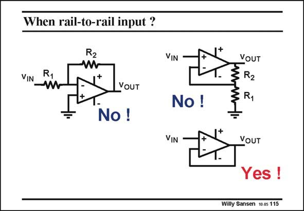

# SANSEN-115 · When rail-to-rail input ?

章节：11 轨到轨输入与输出放大器  
PDF 页：296；书本页：303；幻灯片编号：115  
状态：unreviewed



## 对应教材讲解

### PDF 296 · 书本 303

The answer is negative. Three amplifier realizations are shown in this slide. Only one of them requires a railto-rail input range. An inverting amplifier has almost no swing at all at the inputs. The output signal is divided by the open-loop gain so that the minus input hardly sees any signal. At higher frequencies, the minus input sees a larger voltage but never rail-torail! This also applies to the non-inverting amplifier. Both inputs have about the same swing. If some gain is required, then the inputs can never reach rail-to-rail swings. The only configuration which needs rail-to-rail input swing is the buffer. Since the gain is unity, a rail-to-rail output requires the input to be able to follow. Buffers are more often class-AB amplifiers. Most class-AB amplifiers have a rail-to-rail input. Many of the examples given, have a class-AB output.

## 公式／性能结论候选摘录

以下为规则截取的原文，尚未逐项判读。

- PDF 296: The output signal is divided by the open-loop gain so that the minus input hardly sees any signal.
- PDF 296: If some gain is required, then the inputs can never reach rail-to-rail swings.
- PDF 296: Since the gain is unity, a rail-to-rail output requires the input to be able to follow.

## 曲线结论候选摘录

以下为规则截取的原文，尚未逐项判读。

（未由规则找到；不代表原页没有此类内容。）

## 原文条件与近似候选摘录

以下为规则截取的原文，尚未逐项判读。

（未由规则找到；不代表原页没有此类内容。）

## 幻灯片 OCR（未校正）

```text
When rail-to-rail input ?
R2
VIN
VIN
VOUT
No!
VOUT
§ R2
No!
VIN
VOUT
Yes !
Willy Sansen 10 05 115
```

数学上下标、分数及正负号以原图为准。电路图已保留；未核对的连接不输出成可仿真 netlist。
