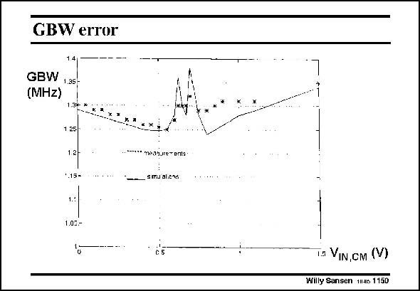

# SANSEN-1150 · GBW error

章节：11 轨到轨输入与输出放大器  
PDF 页：318；书本页：325；幻灯片编号：1150  
状态：unreviewed



## 对应教材讲解

### PDF 318 · 书本 325

The actual change in input transconductance or GBW over the common mode input range is about 6%. The actual crossover region shows the most irregularities. In this design example, the change in transconductance may even be more important for the distortion than the change in offset. Let us have a look at the offset indeed.

## 公式／性能结论候选摘录

以下为规则截取的原文，尚未逐项判读。

（未由规则找到；不代表原页没有此类内容。）

## 曲线结论候选摘录

以下为规则截取的原文，尚未逐项判读。

（未由规则找到；不代表原页没有此类内容。）

## 原文条件与近似候选摘录

以下为规则截取的原文，尚未逐项判读。

（未由规则找到；不代表原页没有此类内容。）

## 幻灯片 OCR（未校正）

```text
GBW error
GBW
1.35-
(MHz)
1 25
1.2
*.15-
1.00.-
T.a VIN,CM (V)
Willy Sansen 1i16 1150
```

数学上下标、分数及正负号以原图为准。电路图已保留；未核对的连接不输出成可仿真 netlist。
