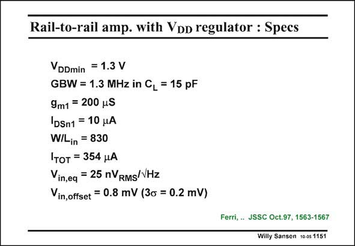

# SANSEN-1151 · Rail-to-rail amp. with VoD regulator : Specs

章节：11 轨到轨输入与输出放大器  
PDF 页：319；书本页：326；幻灯片编号：1151  
状态：unreviewed



## 对应教材讲解

### PDF 319 · 书本 326

Some of the specifications are collected here. Its FOM is not poor, as it is 56 MHzpF/mA. This shows again that duplicating the input stage of a twostage opamp is more acceptable from the point of view of power consumption. The input g /I is m1 DS1 about 20 V−1, which shows that the transistor is in weak inversion. Because of the low currents used, the equivalent input noise is rather high. In weak inversion, the transistors have large sizes. The offset is fairly small. The change of offset is fairly small as well!

## 公式／性能结论候选摘录

以下为规则截取的原文，尚未逐项判读。

（未由规则找到；不代表原页没有此类内容。）

## 曲线结论候选摘录

以下为规则截取的原文，尚未逐项判读。

（未由规则找到；不代表原页没有此类内容。）

## 原文条件与近似候选摘录

以下为规则截取的原文，尚未逐项判读。

（未由规则找到；不代表原页没有此类内容。）

## 幻灯片 OCR（未校正）

```text
Rail-to-rail amp. with VoD regulator : Specs
VDDmin = 1.3 V
GBW = 1.3 MHz in CL = 15 pF
9m1 = 200 uS
|DSn1 = 10 A
W/Lin = 830
Iтот = 354 HA
Vin,eq = 25 nVRMS/VHz
Vin, offset = 0.8 mV (3o = 0.2 mV)
Ferri, .. JSSC Oct.97, 1563-1567
Willy Sansen 100s 1151
```

数学上下标、分数及正负号以原图为准。电路图已保留；未核对的连接不输出成可仿真 netlist。
