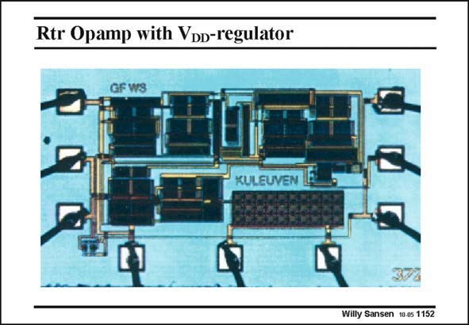

# SANSEN-1152 · Rtr Opamp with Voo-regulator

章节：11 轨到轨输入与输出放大器  
PDF 页：319；书本页：326；幻灯片编号：1152  
状态：unreviewed



## 对应教材讲解

### PDF 319 · 书本 326

The area of this opamp is about 1.5×0.8 mm. This is quite large as many two replica input stages have been added. Moreover, all input transistors work in weak inversion such that they have large sizes. This is clearly visible.

## 公式／性能结论候选摘录

以下为规则截取的原文，尚未逐项判读。

（未由规则找到；不代表原页没有此类内容。）

## 曲线结论候选摘录

以下为规则截取的原文，尚未逐项判读。

（未由规则找到；不代表原页没有此类内容。）

## 原文条件与近似候选摘录

以下为规则截取的原文，尚未逐项判读。

（未由规则找到；不代表原页没有此类内容。）

## 幻灯片 OCR（未校正）

```text
Rtr Opamp with Voo-regulator
GF WS
KULEUVEN
Willy Sansen 10 os 1152
```

数学上下标、分数及正负号以原图为准。电路图已保留；未核对的连接不输出成可仿真 netlist。
