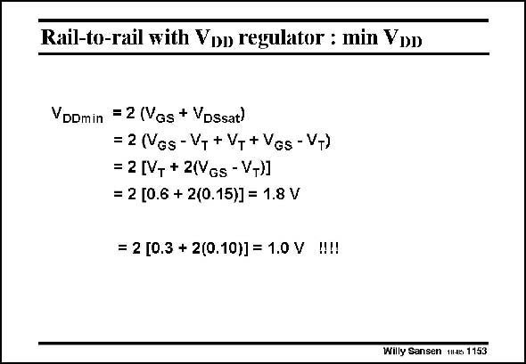

# SANSEN-1153 · Rail-to-rail with Voo regulator : min VDD

章节：11 轨到轨输入与输出放大器  
PDF 页：320；书本页：327；幻灯片编号：1153  
状态：unreviewed



## 对应教材讲解

### PDF 320 · 书本 327

All these rail-to-rail amplifiers need a double V GSn +V as a supply voltage DSsatn to be able to operate. For example, for a V of T 0.6 V and a V −V of GS T 0.15 V, the supply voltage becomes 1.8 V. Reducing the V to 0.3 V as is the T case for CMOS technologies with 90 nm channel length and below, the supply voltage could reach the 1 V level indeed. The condition is however, that the transistor works more in weak inversion. Its V −V of 0.10 V is very close to the 70–80 mV crossover GS T value between strong and weak inversion (see Chapter 1).

## 公式／性能结论候选摘录

以下为规则截取的原文，尚未逐项判读。

（未由规则找到；不代表原页没有此类内容。）

## 曲线结论候选摘录

以下为规则截取的原文，尚未逐项判读。

（未由规则找到；不代表原页没有此类内容。）

## 原文条件与近似候选摘录

以下为规则截取的原文，尚未逐项判读。

（未由规则找到；不代表原页没有此类内容。）

## 幻灯片 OCR（未校正）

```text
Rail-to-rail with Voo regulator : min VDD
VDDmin = 2 (Vgs + VDssat)
= 2 (Ngs-V+ + VT + Ves - V+)
= 2 [V, + 2(Vgs - V+)]
= 2 [0.6 + 2(0.15)] = 1.8 V
= 2 [0.3 + 2(0.10)] = 1.0 V
W!!
Willy Sansen tJe 1153
```

数学上下标、分数及正负号以原图为准。电路图已保留；未核对的连接不输出成可仿真 netlist。
