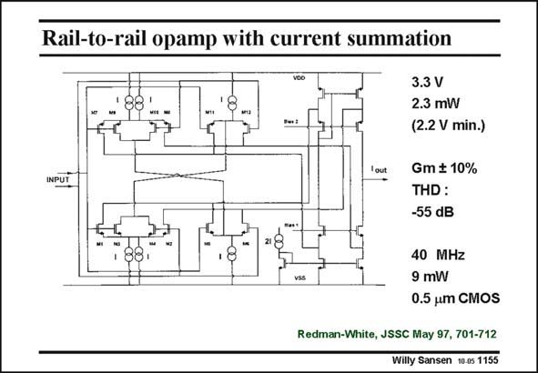

# SANSEN-1155 · Rail-to-rail opamp with current summation

章节：11 轨到轨输入与输出放大器  
PDF 页：321；书本页：328；幻灯片编号：1155  
状态：unreviewed



## 对应教材讲解

### PDF 321 · 书本 328

Another way to keep the sum of the currents constant over the whole commonmode input range is shown in this slide. This will allow the sum of the transconductances to stay constant, provided the transistors are biased in weak inversion. The input stage is shown in this slide. A second stage has to be added to make a full opamp. This input stage consumes 2.3 mW, whereas the full opamp is 9 mW (all on 3.3 V). The supply voltage can be as low as 2.2 V however, as demonstrated previously. When the input voltages are halfway the supply voltage, then all input nMOSTs M1-M4 are carrying a current I/2 (and so do the input pMOSTs M7-M10). Transistors M3 and M4 pull all current I away from the pMOSTs M11-M12, such that these latter devices are off. In the same way, transistors M5 and M6 are off. When the common-mode input voltage is high, pMOSTs M7-M10 go off. Transistors M9-M10 do not pull current away any more from M5 and M6, which now carry current I/2 as well. The nMOSTs M1-M2 and M5-M6 now contribute to the total transconductance. For a high CM input voltage, transistors M5-M6 take over the role of M7-M8. This is in the same way as for low CM input voltages, M11-M12 takes over the role of M1-M2. The total current and transconductance is therefore constant over the whole common-mode input range.

## 公式／性能结论候选摘录

以下为规则截取的原文，尚未逐项判读。

- PDF 321: The total current and transconductance is therefore constant over the whole common-mode input range.

## 曲线结论候选摘录

以下为规则截取的原文，尚未逐项判读。

（未由规则找到；不代表原页没有此类内容。）

## 原文条件与近似候选摘录

以下为规则截取的原文，尚未逐项判读。

- PDF 321: This will allow the sum of the transconductances to stay constant, provided the transistors are biased in weak inversion.

## 幻灯片 OCR（未校正）

```text
Rail-to-rail opamp with current summation
INPUT
Pen3
3.3 V
2.3 mW
(2.2 V min.)
Gm $ 10%
THD:
-55 dB
40 MHz
9 mW
0.5 um CMOS
Redman-White, JSSC May 97, 701-712
Willy Sansen 10.05 1155
```

数学上下标、分数及正负号以原图为准。电路图已保留；未核对的连接不输出成可仿真 netlist。
