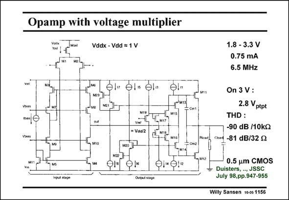

# SANSEN-1156 · Opamp with voltage multiplier

章节：11 轨到轨输入与输出放大器  
PDF 页：321；书本页：328；幻灯片编号：1156  
状态：unreviewed



## 对应教材讲解

### PDF 321 · 书本 328

Distortion is the main problem of CMOS rail-to-rail input amplifiers. Without trimming, they cannot offer more than 40–50 dB signalto-distortion ratio. This amplifier provides a solution. Its signal-to-distortion ratio can be as high as 90 dB! This is accomplished by using only one differential pair at the input. An internal voltage regulator is used, which provides an internal supply voltage, this is always higher than the external one by about 1 V. This Volt is sufficient to allow the input Gates

### PDF 322 · 书本 329

to cover the full supply voltage. It is thus a rail-to-rail input amplifier indeed, but with low distortion. The second stage is a class-AB amplifier, which will be discussed in Chapter 12.

## 公式／性能结论候选摘录

以下为规则截取的原文，尚未逐项判读。

- PDF 322: It is thus a rail-to-rail input amplifier indeed, but with low distortion.

## 曲线结论候选摘录

以下为规则截取的原文，尚未逐项判读。

（未由规则找到；不代表原页没有此类内容。）

## 原文条件与近似候选摘录

以下为规则截取的原文，尚未逐项判读。

（未由规则找到；不代表原页没有此类内容。）

## 幻灯片 OCR（未校正）

```text
Opamp with voltage multiplier
Vddx - Vdd = 1 V
els el-
Vbias
M19
M15
= Vaa/2
MIS.
MtG
, М1O
О"0!"
Input stage
1.8 - 3.3 V
0.75 mA
6.5 MHz
Cet
On 3 V :
2.8 ptpt
THD:
-90 dB /10k
0 -81 dB/32 9
0.5 um CMOS
Duisters, , JSSC
July 98,pp.947-955
Willy Sansen 10-05 1156
```

数学上下标、分数及正负号以原图为准。电路图已保留；未核对的连接不输出成可仿真 netlist。
