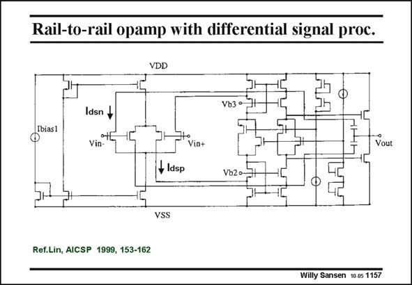

# SANSEN-1157 · Rail-to-rail opamp with differential signal proc.

章节：11 轨到轨输入与输出放大器  
PDF 页：322；书本页：329；幻灯片编号：1157  
状态：unreviewed



## 对应教材讲解

### PDF 322 · 书本 329

This rail-to-rail opamp is well known. It consists of a double folded cascode followed by a class-AB second stage with Miller compensation through the cascodes. The g −equalization still m has to be added though. The principle is discussed next. Note that for increasing Vin-, both currents I and dsn I increase. One of them dsp will disappear however, when the common-mode voltage V is high or low. INCM When V is high, the INCM input pMOSTs are off and I disappears but I survives. dsp dsn If we now apply a maximum-current selecting circuit to I and I , the larger one will dsn dsp survive. This is the current that is passed on to the next stage. We now have to insert a maximum-current selector between the Drains which carry I and dsn I and the second stage. dsp

## 公式／性能结论候选摘录

以下为规则截取的原文，尚未逐项判读。

- PDF 322: The g −equalization still m has to be added though.
- PDF 322: Note that for increasing Vin-, both currents I and dsn I increase.

## 曲线结论候选摘录

以下为规则截取的原文，尚未逐项判读。

（未由规则找到；不代表原页没有此类内容。）

## 原文条件与近似候选摘录

以下为规则截取的原文，尚未逐项判读。

（未由规则找到；不代表原页没有此类内容。）

## 幻灯片 OCR（未校正）

```text
Rail-to-rail opamp with differential signal proc.
VDD
Vb3 °
Ibias1
Idsn +
Vin-
Vin+
Vout
+ Idsp
Vb2 o~
VSS
Ref.Lin, AICSP 1999, 153-162
Willy Sansen 10 0s 1157
```

数学上下标、分数及正负号以原图为准。电路图已保留；未核对的连接不输出成可仿真 netlist。
