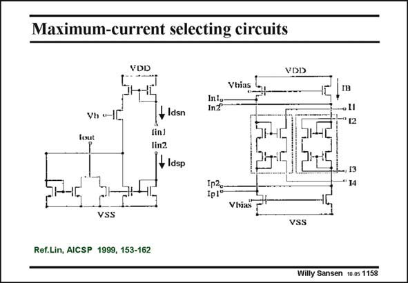

# SANSEN-1158 · Maximum-current selecting circuits

章节：11 轨到轨输入与输出放大器  
PDF 页：322；书本页：329；幻灯片编号：1158  
状态：unreviewed



## 对应教材讲解

### PDF 322 · 书本 329

The g -equalization makes m use of maximum-current selector circuits. The main difference with all previous rail-to-rail amplifiers is that all g −equalizers made use m of common-mode circuitry. All added noise is therefore common-mode noise, which is cancelled by the differential output. The g −equalizers dism cussed here, act on the differential circuits. All added noise now ends up in the signal path. It cannot be cancelled any more. Two maximum-current selecting circuits are shown in this slide. The left one is a single-ended one, whereas the right one is floating.

### PDF 323 · 书本 330

The nMOST Drain with current I is connected to the Iin1 input, and the pMOST Drain dsn with current I to the Iin2 input. Both currents are summed by the current mirrors towards dsp Iout. As a consequence, the larger current wins. It is then fed to the second stage. The maximum-current selecting circuits on the right is explained next.

## 公式／性能结论候选摘录

以下为规则截取的原文，尚未逐项判读。

- PDF 322: The g -equalization makes m use of maximum-current selector circuits.
- PDF 322: The main difference with all previous rail-to-rail amplifiers is that all g −equalizers made use m of common-mode circuitry.
- PDF 322: All added noise is therefore common-mode noise, which is cancelled by the differential output.
- PDF 322: The g −equalizers dism cussed here, act on the differential circuits.

## 曲线结论候选摘录

以下为规则截取的原文，尚未逐项判读。

（未由规则找到；不代表原页没有此类内容。）

## 原文条件与近似候选摘录

以下为规则截取的原文，尚未逐项判读。

（未由规则找到；不代表原页没有此类内容。）

## 幻灯片 OCR（未校正）

```text
Maximum-current selecting circuits
VDD
VDD
Yhias
IC
Inle
In?
Vh o-
IB
• 11
"12
fout
+ ldsn
linJ
lin2
Tt Idsp
•, [3
*14
1p2o
Ip!°
Vhias
VSS
VSS
Ref.Lin, AICSP 1999, 153-162
Willy Sansen 10.05 1158
```

数学上下标、分数及正负号以原图为准。电路图已保留；未核对的连接不输出成可仿真 netlist。
