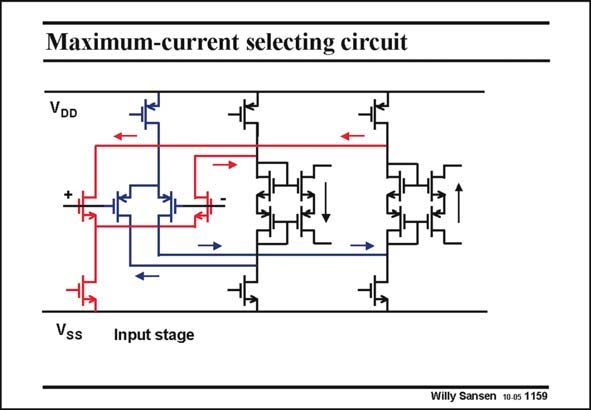

# SANSEN-1159 · Maximum-current selecting circuit

章节：11 轨到轨输入与输出放大器  
PDF 页：323；书本页：330；幻灯片编号：1159  
状态：unreviewed



## 对应教材讲解

### PDF 323 · 书本 330

The polarities of the circular currents are indicated. The +input is assumed to rise. It is clear that both rising currents are led to a floating current mirror (most right), the output of which goes to the second stage. Both currents of opposite polarity are flowing through the left floating current mirror. Its output goes to the other output transistor.

## 公式／性能结论候选摘录

以下为规则截取的原文，尚未逐项判读。

（未由规则找到；不代表原页没有此类内容。）

## 曲线结论候选摘录

以下为规则截取的原文，尚未逐项判读。

（未由规则找到；不代表原页没有此类内容。）

## 原文条件与近似候选摘录

以下为规则截取的原文，尚未逐项判读。

- PDF 323: The +input is assumed to rise.

## 幻灯片 OCR（未校正）

```text
Maximum-current selecting circuit
VDD
→
Vss
Input stage
Willy Sansen 10.05 1159
```

数学上下标、分数及正负号以原图为准。电路图已保留；未核对的连接不输出成可仿真 netlist。
