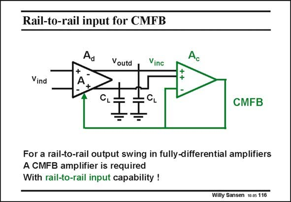

# SANSEN-116 · Rail-to-rail input for CMFB

章节：11 轨到轨输入与输出放大器  
PDF 页：296；书本页：303；幻灯片编号：116  
状态：unreviewed



## 对应教材讲解

### PDF 296 · 书本 303

Another good application of a rail-to-rail input is the CMFB amplifier required in fully-differential amplifiers. However, the output swing of the differential amplifier is followed by a CMFB amplifier. In order to be able to have rail-torail differential output swing we must have a rail-to-rail input swing for the CMFB amplifier. This is rarely the case as rail-to-rail input amplifiers are more complicated. As a consequence, they are difficult to be realized at high frequencies with limited power consumption.

## 公式／性能结论候选摘录

以下为规则截取的原文，尚未逐项判读。

- PDF 296: As a consequence, they are difficult to be realized at high frequencies with limited power consumption.

## 曲线结论候选摘录

以下为规则截取的原文，尚未逐项判读。

（未由规则找到；不代表原页没有此类内容。）

## 原文条件与近似候选摘录

以下为规则截取的原文，尚未逐项判读。

（未由规则找到；不代表原页没有此类内容。）

## 幻灯片 OCR（未校正）

```text
Rail-to-rail input for CMFB
Voutd
Vinc
Vind
CL
CL
CMFB
For a rail-to-rail output swing in fully-differential amplifiers
A CMFB amplifier is required
With rail-to-rail input capability !
Willy Sansen 10.05 116
```

数学上下标、分数及正负号以原图为准。电路图已保留；未核对的连接不输出成可仿真 netlist。
