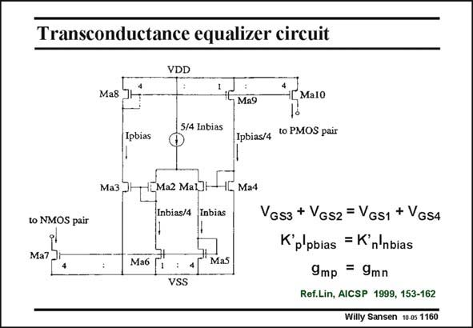

# SANSEN-1160 · Transconductance equalizer circuit

章节：11 轨到轨输入与输出放大器  
PDF 页：323；书本页：330；幻灯片编号：1160  
状态：unreviewed



## 对应教材讲解

### PDF 323 · 书本 330

Another circuit of interest is the biasing circuit which makes sure that the nMOSTs and pMOSTs have equal transconductances. This circuit is shown in this slide. Transistors Ma1–4 form a translinear loop, as indicated by the expression with the V ’s. GS The V ’s drop out. What is T left is an expression with the currents and the transistor sizes. All currents are indicated, and so are the W/K ratio’s. The result is that the K’I products for both a nMOST and a pMOST are the same. Their DS transconductances are the same as well. This is therefore a transconductance equalizer circuit.

## 公式／性能结论候选摘录

以下为规则截取的原文，尚未逐项判读。

- PDF 323: Another circuit of interest is the biasing circuit which makes sure that the nMOSTs and pMOSTs have equal transconductances.
- PDF 323: This is therefore a transconductance equalizer circuit.

## 曲线结论候选摘录

以下为规则截取的原文，尚未逐项判读。

（未由规则找到；不代表原页没有此类内容。）

## 原文条件与近似候选摘录

以下为规则截取的原文，尚未逐项判读。

（未由规则找到；不代表原页没有此类内容。）

## 幻灯片 OCR（未校正）

```text
Transconductance equalizer circuit
VDD
Ma8
MalO
Ma9
5/4 Inbias
Ipbias
Ipbias/4
to PMOS pair
Ma3]
1[Ma2 Mal]H
Inbias/4
Ma4
Inbias
to NMOS pair
Ma7.
Маб
Mas
VSS
VGs3 + VGs2 = VGs1 + VGs4
K'p'pbias = K'n'nbias
9mp = 9mn
Ref.Lin, AICSP 1999, 153-162
Willy Sansen 10.05 1160
```

数学上下标、分数及正负号以原图为准。电路图已保留；未核对的连接不输出成可仿真 netlist。
