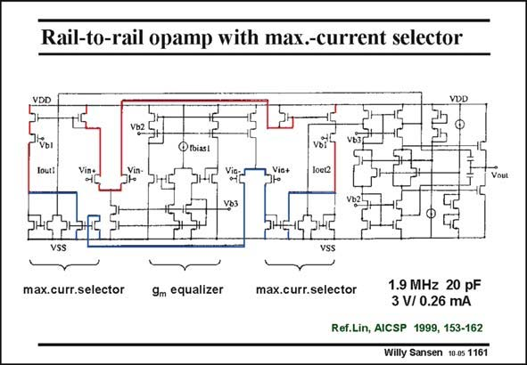

# SANSEN-1161 · Rail-to-rail opamp with max.-current selector

章节：11 轨到轨输入与输出放大器  
PDF 页：324；书本页：331；幻灯片编号：1161  
状态：unreviewed



## 对应教材讲解

### PDF 324 · 书本 331

The first type of maximumcurrent selector and transconductance equalizer circuit are added to the rail-torail amplifier, shown first. Both maximum-current selectors are easily found. Their outputs go to a differential current amplifier with cascodes. Its outputs then drive the Gates of the output transistors. It is still a two-stage amplifier, despite the complexity of the first stage. The equivalent input noise is therefore rather high.

## 公式／性能结论候选摘录

以下为规则截取的原文，尚未逐项判读。

- PDF 324: The first type of maximumcurrent selector and transconductance equalizer circuit are added to the rail-torail amplifier, shown first.
- PDF 324: The equivalent input noise is therefore rather high.

## 曲线结论候选摘录

以下为规则截取的原文，尚未逐项判读。

（未由规则找到；不代表原页没有此类内容。）

## 原文条件与近似候选摘录

以下为规则截取的原文，尚未逐项判读。

（未由规则找到；不代表原页没有此类内容。）

## 幻灯片 OCR（未校正）

```text
Rail-to-rail opamp with max.-current selector
VDD
Vbl
Ioc2
Vout
max.curr.selector
9m equalizer
max.curr.selector
1.9 MHz 20 pF
3 V/ 0.26 mA
Ref.Lin, AICSP 1999, 153-162
Willy Sansen 10-05 1161
```

数学上下标、分数及正负号以原图为准。电路图已保留；未核对的连接不输出成可仿真 netlist。
