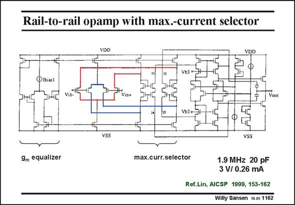

# SANSEN-1162 · Rail-to-rail opamp with max.-current selector

章节：11 轨到轨输入与输出放大器  
PDF 页：324；书本页：331；幻灯片编号：1162  
状态：unreviewed



## 对应教材讲解

### PDF 324 · 书本 331

The floating maximum-current selector and transconductance equalizer circuit are added to the same railto-rail amplifier, as shown in this slide. The outputs go to the same second stage as before. It is thus also a second stage amplifier. However, the input devices have a more symmetrical load. The CMRR is now higher. Remember that the noise is rather high because of the analog signal processing applied directly to the AC currents, and not to the common-mode circuitry or the biasing.

## 公式／性能结论候选摘录

以下为规则截取的原文，尚未逐项判读。

- PDF 324: The floating maximum-current selector and transconductance equalizer circuit are added to the same railto-rail amplifier, as shown in this slide.
- PDF 324: It is thus also a second stage amplifier.

## 曲线结论候选摘录

以下为规则截取的原文，尚未逐项判读。

（未由规则找到；不代表原页没有此类内容。）

## 原文条件与近似候选摘录

以下为规则截取的原文，尚未逐项判读。

（未由规则找到；不代表原页没有此类内容。）

## 幻灯片 OCR（未校正）

```text
Rail-to-rail opamp with max.-current selector
VDD
ibiast
Vout
VSS
9m equalizer
max.curr.selector
1.9 MHz 20 pF
3 V/ 0.26 mА
Ref.Lin, AICSP 1999, 153-162
Willy Sansen 10-05 1162
```

数学上下标、分数及正负号以原图为准。电路图已保留；未核对的连接不输出成可仿真 netlist。
