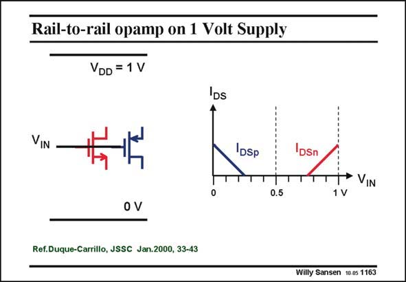

# SANSEN-1163 · Rail-to-rail opamp on 1 Volt Supply

章节：11 轨到轨输入与输出放大器  
PDF 页：325；书本页：332；幻灯片编号：1163  
状态：unreviewed



## 对应教材讲解

### PDF 325 · 书本 332

In order to be able to reach a supply voltage, even with V ’s of 0.7 V is not an easy T task. Whatever circuitry is applied to the input devices, an average input voltage of 0.5 V will never allow either the nMOST or the pMOST to conduct. Only the input devices are shown of two folded cascodes. Only for input voltages larger than about 0.8 V, the nMOST starts conducting. Also, the pMOST can only conduct for average input voltages below about 0.2 V.

## 公式／性能结论候选摘录

以下为规则截取的原文，尚未逐项判读。

（未由规则找到；不代表原页没有此类内容。）

## 曲线结论候选摘录

以下为规则截取的原文，尚未逐项判读。

（未由规则找到；不代表原页没有此类内容。）

## 原文条件与近似候选摘录

以下为规则截取的原文，尚未逐项判读。

（未由规则找到；不代表原页没有此类内容。）

## 幻灯片 OCR（未校正）

```text
Rail-to-rail opamp on 1 Volt Supply
VDD = 1 V
DS
VIN
IDSp
T|
0.5
Ref.Duque-Carrillo, JSSC Jan.2000, 33-43
DSn
TTT'VIN
1 V
Willy Sansen 10.05 1163
```

数学上下标、分数及正负号以原图为准。电路图已保留；未核对的连接不输出成可仿真 netlist。
