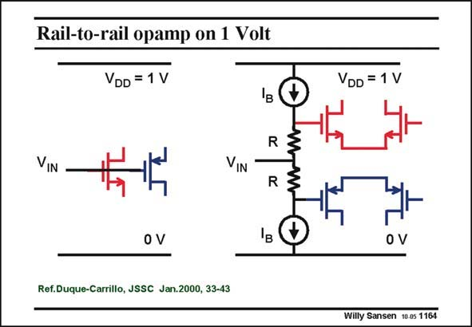

# SANSEN-1164 · Rail-to-rail opamp on 1 Volt

章节：11 轨到轨输入与输出放大器  
PDF 页：325；书本页：332；幻灯片编号：1164  
状态：unreviewed



## 对应教材讲解

### PDF 325 · 书本 332

The solution is to insert level shifters. Indeed, inserting two resistors R between the actual input and the Gates, and two current sources I B allows the necessary level shifting. For example, with currents of 10 mA and resistors of 30 kV, the level shift is then 0.3 V. For an input voltage of 0.5 V, the nMOST Gate is at 0.8 V and the pMOST Gate at 0.2 V. Both transistors are now operational. Note that this current source I is only needed when the input voltage is B 0.5 V. It can disappear for other input voltages. For example, if the input voltage is 0.2 V or lower, current I can be zero. B

## 公式／性能结论候选摘录

以下为规则截取的原文，尚未逐项判读。

（未由规则找到；不代表原页没有此类内容。）

## 曲线结论候选摘录

以下为规则截取的原文，尚未逐项判读。

（未由规则找到；不代表原页没有此类内容。）

## 原文条件与近似候选摘录

以下为规则截取的原文，尚未逐项判读。

（未由规则找到；不代表原页没有此类内容。）

## 幻灯片 OCR（未校正）

```text
Rail-to-rail opamp on 1 Volt
VDD = 1 V
VIN
VIN
R
0 V
Ref.Duque-Carrillo, JSSC Jan.2000, 33-43
-W—W
VDD = 1 V
0 V
Willy Sansen 10-05 1164
```

数学上下标、分数及正负号以原图为准。电路图已保留；未核对的连接不输出成可仿真 netlist。
