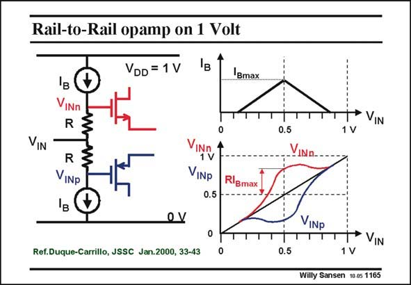

# SANSEN-1165 · Rail-to-Rail opamp on 1 Volt

章节：11 轨到轨输入与输出放大器  
PDF 页：326；书本页：333；幻灯片编号：1165  
状态：unreviewed



## 对应教材讲解

### PDF 326 · 书本 333

In this realization a current is generated which is triangular with its maximum at 0.5 V, and which becomes zero for inputs below 0.2 V or higher than 0.8 V. The actual input voltage and the Gate voltages are plotted versus average input voltage. It is clearly seen that for input voltages larger than 0.5 V, the nMOST already conducts. Also, the pMOST conducts for input voltages up to 0.5 V. A railto-rail input range is now obtained.

## 公式／性能结论候选摘录

以下为规则截取的原文，尚未逐项判读。

（未由规则找到；不代表原页没有此类内容。）

## 曲线结论候选摘录

以下为规则截取的原文，尚未逐项判读。

- PDF 326: The actual input voltage and the Gate voltages are plotted versus average input voltage.

## 原文条件与近似候选摘录

以下为规则截取的原文，尚未逐项判读。

（未由规则找到；不代表原页没有此类内容。）

## 幻灯片 OCR（未校正）

```text
Rail-to-Rail opamp on 1 Volt
VDD=1 V
Bmax
VIN
VINn
R
R
VINP
Ів
VINY
VINp
0.5
Rißm
Ref.Duque-Carrillo, JSSC Jan.2000, 33-43
→ VIN
0.5
VINn..
VINp
0.5
T* VIN
Willy Sansen 10-05 1165
```

数学上下标、分数及正负号以原图为准。电路图已保留；未核对的连接不输出成可仿真 netlist。
