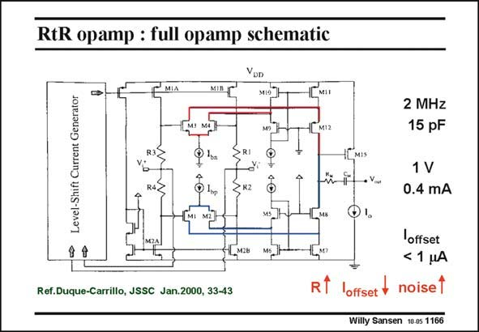

# SANSEN-1166 · RtR opamp : full opamp schematic

章节：11 轨到轨输入与输出放大器  
PDF 页：326；书本页：333；幻灯片编号：1166  
状态：unreviewed



## 对应教材讲解

### PDF 326 · 书本 333

The full schematic is shown in this slide. Four resistors and current sources are used to levelshift the inputs. The currents I are derived in a separate B current generator. The outputs then simply go to two differential current amplifiers. A simple second stage is provided to be able to output the signal. This rail-to-rail input arrangement also has some drawbacks. First of all, the four current sources I , may B not match that well. Their difference in current flows out and gives rise to a kind of bias current (as is common in bipolar amplifiers). Moreover, they may not be the same for both inputs. There is thus also an offset current. Another disadvantage is the presence of noisy resistors in series with all four inputs. The noise performance will now suffer. It is possible to reduce these resistors but larger currents I are required, worsening the input B offset currents. It is the only rail-to-rail input opamp however, which works on 1 V for conventional V ’s. T

## 公式／性能结论候选摘录

以下为规则截取的原文，尚未逐项判读。

- PDF 326: There is thus also an offset current.

## 曲线结论候选摘录

以下为规则截取的原文，尚未逐项判读。

（未由规则找到；不代表原页没有此类内容。）

## 原文条件与近似候选摘录

以下为规则截取的原文，尚未逐项判读。

- PDF 326: A simple second stage is provided to be able to output the signal.

## 幻灯片 OCR（未校正）

```text
RtR opamp : full opamp schematic
Level-Shift Current Generator
M19
• R2
2 MHz
15 pF
1 V
0.4 mA
Ref.Duque-Carrillo, JSSC Jan.2000, 33-43
R
loffset
< 1 MA
loffset + noisel
Willy Sansen 10.05 1166
```

数学上下标、分数及正负号以原图为准。电路图已保留；未核对的连接不输出成可仿真 netlist。
