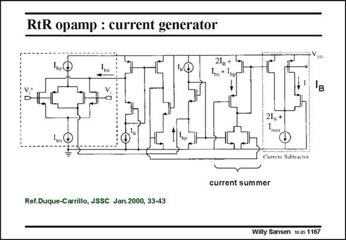

# SANSEN-1167 · RtR opamp : current generator

章节：11 轨到轨输入与输出放大器  
PDF 页：327；书本页：334；幻灯片编号：1167  
状态：unreviewed



## 对应教材讲解

### PDF 327 · 书本 334

The level-shift current generator is shown in this slide. It has to generate an output current which first increases with the input voltage and then decreases again. It is obviously a commonmode block. A replica input stage is used, in which the differential signals are cancelled. The outputs are led to a current summer by means of a number of current sources. Its output thus gives rise to a pseudo-triangular output current I . B

## 公式／性能结论候选摘录

以下为规则截取的原文，尚未逐项判读。

- PDF 327: It has to generate an output current which first increases with the input voltage and then decreases again.
- PDF 327: Its output thus gives rise to a pseudo-triangular output current I .

## 曲线结论候选摘录

以下为规则截取的原文，尚未逐项判读。

（未由规则找到；不代表原页没有此类内容。）

## 原文条件与近似候选摘录

以下为规则截取的原文，尚未逐项判读。

（未由规则找到；不代表原页没有此类内容。）

## 幻灯片 OCR（未校正）

```text
RtR opamp : current generator
21
21,+
Inax
wrten.iha
current summer
Ref.Duque-Carrillo, JSSC Jan.2000, 33-43
Willy Sansen 10-05 1167
```

数学上下标、分数及正负号以原图为准。电路图已保留；未核对的连接不输出成可仿真 netlist。
