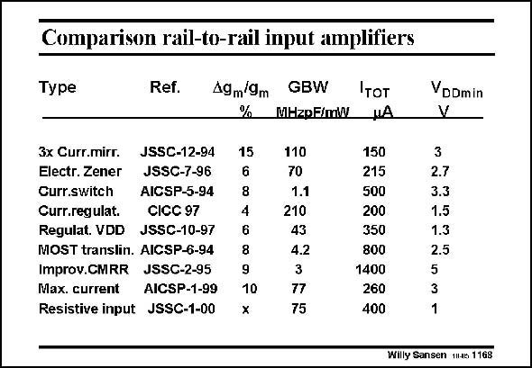

# SANSEN-1168 · Comparison rail-to-rail input amplifiers

章节：11 轨到轨输入与输出放大器  
PDF 页：327；书本页：334；幻灯片编号：1168  
状态：unreviewed



## 对应教材讲解

### PDF 327 · 书本 334

As a conclusion, a comparative table is given comparing the different specifications of the types discussed. The first column is the type, followed by the reference. The error is given in transconductance. Most of them achieve 5–8%. This will give rise to some distortion, which is normally smaller however than the distortion due to the changing offset voltage. The FOM indicates how much current has been consumed by the addition of circuitry for the rail-to-rail input. Anything that is larger than 30–50 is more acceptable. It is seen that only amplifiers with a large FOM have been discussed in this Chapter. Some other ones are added which are less attractive. The column with current does not mean much. The effect of the current has been included in the FOM. The last column lists the minimum supply voltages. For most standard opamps this is about 2.5 V. The two amplifiers with 1.5 and 1.3 V use input devices in weak inversion and are optimized towards low supply voltages. The only 1 V amplifier is the last one. It compromises however, on specifications which are not listed here, such as input noise and input biasing current.

## 公式／性能结论候选摘录

以下为规则截取的原文，尚未逐项判读。

- PDF 327: As a conclusion, a comparative table is given comparing the different specifications of the types discussed.

## 曲线结论候选摘录

以下为规则截取的原文，尚未逐项判读。

（未由规则找到；不代表原页没有此类内容。）

## 原文条件与近似候选摘录

以下为规则截取的原文，尚未逐项判读。

（未由规则找到；不代表原页没有此类内容。）

## 幻灯片 OCR（未校正）

```text
Comparison rail-to-rail input amplifiers
Type
Ref.
A9m 9m
%
3x Curr.mirr.
JSSC-12-94
Electr. Zener
JSSC-7-96
Curr.switch
AICSP-5-94
Curr.regulat.
CICC 97
Regulat. VDD JSSC-10-97
MOST translin. AICSP-6-94
Improv.CMRR JSSC-2-95
Max. current
AICSP-1-99
Resistive input JSSC-1-00
GBW
MHzpF/mW
Iтот
NA
15
8
4
6
8
9
10
x
110
70
1.1
210
43
4.2
3
77
75
150
215
500
200
350
800
1400
260
400
VDDmin
V
3
2.7
3.3
1.5
1.3
2.5
5
1
Willy Sansen miae 1168
```

数学上下标、分数及正负号以原图为准。电路图已保留；未核对的连接不输出成可仿真 netlist。
