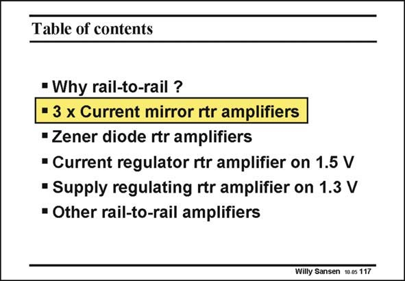

# SANSEN-117 · Table of contents

章节：11 轨到轨输入与输出放大器  
PDF 页：297；书本页：304；幻灯片编号：117  
状态：unreviewed



## 对应教材讲解

### PDF 297 · 书本 304

The first type of rail-to-rail input amplifier is the one that uses 3× current mirrors, as shown next.

## 公式／性能结论候选摘录

以下为规则截取的原文，尚未逐项判读。

（未由规则找到；不代表原页没有此类内容。）

## 曲线结论候选摘录

以下为规则截取的原文，尚未逐项判读。

（未由规则找到；不代表原页没有此类内容。）

## 原文条件与近似候选摘录

以下为规则截取的原文，尚未逐项判读。

（未由规则找到；不代表原页没有此类内容。）

## 幻灯片 OCR（未校正）

```text
Table of contents
• Why rail-to-rail ?
• 3 x Current mirror rtr amplifiers
• Zener diode rtr amplifiers
• Current regulator rtr amplifier on 1.5 V
• Supply regulating rtr amplifier on 1.3 V
" Other rail-to-rail amplifiers
Willy Sansen 10 os 117
```

数学上下标、分数及正负号以原图为准。电路图已保留；未核对的连接不输出成可仿真 netlist。
