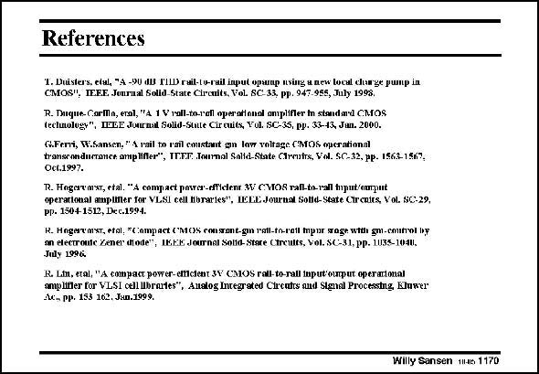

# SANSEN-1170 · References

章节：11 轨到轨输入与输出放大器  
PDF 页：328；书本页：335；幻灯片编号：1170  
状态：unreviewed



## 对应教材讲解

本页为参考文献幻灯片；已查看原 PDF，原页没有另外的正文讲解。

## 公式／性能结论候选摘录

以下为规则截取的原文，尚未逐项判读。

（未由规则找到；不代表原页没有此类内容。）

## 曲线结论候选摘录

以下为规则截取的原文，尚未逐项判读。

（未由规则找到；不代表原页没有此类内容。）

## 原文条件与近似候选摘录

以下为规则截取的原文，尚未逐项判读。

（未由规则找到；不代表原页没有此类内容。）

## 幻灯片 OCR（未校正）

```text
References
. Tgus../Wdlsarel.emastul scpieyh.stan/rl.QMAS
pp. 1504-1512, Dec.1994.
R. Liu, etal, "A compact power- emctent 3Y CMOS rall- to-rall input ourput operattona!
ampufler for VLSI oell Ubrartes*, Alalog Integrated Circutts aud Stgnal Processing, Kluwer
Лe. рр. 153 162. Jнш.1999.
Willy Sansen tJe 1170
```

数学上下标、分数及正负号以原图为准。电路图已保留；未核对的连接不输出成可仿真 netlist。
