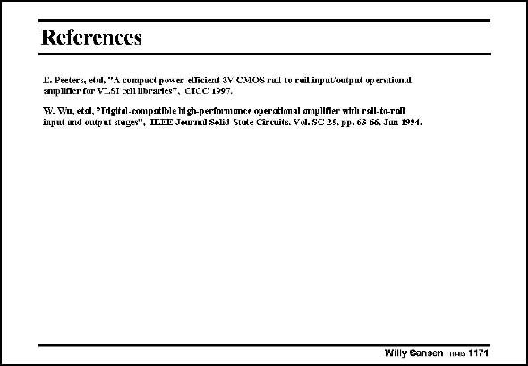

# SANSEN-1171 · References

章节：11 轨到轨输入与输出放大器  
PDF 页：329；书本页：336；幻灯片编号：1171  
状态：unreviewed



## 对应教材讲解

本页为参考文献幻灯片；已查看原 PDF，原页没有另外的正文讲解。

## 公式／性能结论候选摘录

以下为规则截取的原文，尚未逐项判读。

（未由规则找到；不代表原页没有此类内容。）

## 曲线结论候选摘录

以下为规则截取的原文，尚未逐项判读。

（未由规则找到；不代表原页没有此类内容。）

## 原文条件与近似候选摘录

以下为规则截取的原文，尚未逐项判读。

（未由规则找到；不代表原页没有此类内容。）

## 幻灯片 OCR（未校正）

```text
References
LPte cpciyenos ratra lnuintpud upernuiunel
w.ww.wal. pngn.eo./at-.as.rtatsmtearasYm2r.wt.rat/.sul4
Willy Sansen 11Je 1171
```

数学上下标、分数及正负号以原图为准。电路图已保留；未核对的连接不输出成可仿真 netlist。
