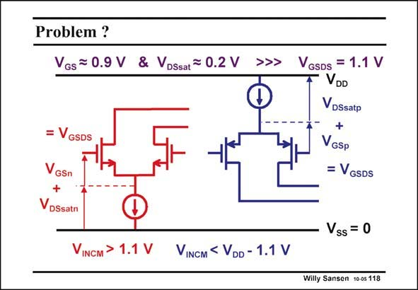

# SANSEN-118 · Problem ? Vos= 0.9 V & VDssat = 0.2 V >>> VGsDs = 1.1 V

章节：11 轨到轨输入与输出放大器  
PDF 页：297；书本页：304；幻灯片编号：118  
状态：unreviewed



## 对应教材讲解

### PDF 297 · 书本 304

The only way to reach a railto-rail input swing is to use two folded cascodes in parallel. Only the input transistors are shown. Each of the input pairs needs a minimum input voltage of one V +V . GS DSsat For a V of 0.7 V, this is T about 1.1 V (when V − GS V =0.2 V). T When both inputs are now connected in parallel, 2.2 V is required as a minimum value for the supply voltage!

## 公式／性能结论候选摘录

以下为规则截取的原文，尚未逐项判读。

（未由规则找到；不代表原页没有此类内容。）

## 曲线结论候选摘录

以下为规则截取的原文，尚未逐项判读。

（未由规则找到；不代表原页没有此类内容。）

## 原文条件与近似候选摘录

以下为规则截取的原文，尚未逐项判读。

（未由规则找到；不代表原页没有此类内容。）

## 幻灯片 OCR（未校正）

```text
Problem ?
Vos= 0.9 V & VDssat = 0.2 V >>> VGsDs = 1.1 V
VDD
VDSsatp
+
GSp
= VGSDS
VGSDS
GSn
VDSsatn
VINCM > 1.1 V
Vss
= 0
VINCM < VDD - 1.1 V
Willy Sansen 10 05 118
```

数学上下标、分数及正负号以原图为准。电路图已保留；未核对的连接不输出成可仿真 netlist。
