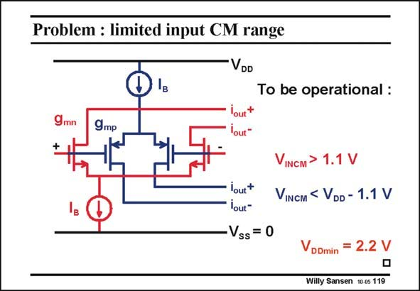

# SANSEN-119 · Problem : limited input CM range

章节：11 轨到轨输入与输出放大器  
PDF 页：298；书本页：305；幻灯片编号：119  
状态：unreviewed



## 对应教材讲解

### PDF 298 · 书本 305

Connecting both inputs in parallel reduces the input common-mode range by 2.2 V. The minimum supply voltage must therefore be a minimum of 2.2 V. In practice the supply voltage will be 2.5 V. We are a long way from a 1 V supply voltage! Even if V were only T 0.3 V, the minimum supply voltage would still be 1.4 V.

## 公式／性能结论候选摘录

以下为规则截取的原文，尚未逐项判读。

- PDF 298: The minimum supply voltage must therefore be a minimum of 2.2 V.

## 曲线结论候选摘录

以下为规则截取的原文，尚未逐项判读。

（未由规则找到；不代表原页没有此类内容。）

## 原文条件与近似候选摘录

以下为规则截取的原文，尚未逐项判读。

（未由规则找到；不代表原页没有此类内容。）

## 幻灯片 OCR（未校正）

```text
Problem : limited input CM range
VDD
To be operational :
9mn
+
gmp
VINCM > 1.1 V
VINCM < VDD - 1.1 V
lout*
lout*
Vss = 0
VDDmin
= 2.2 V
Willy Sansen 10.05 119
```

数学上下标、分数及正负号以原图为准。电路图已保留；未核对的连接不输出成可仿真 netlist。
