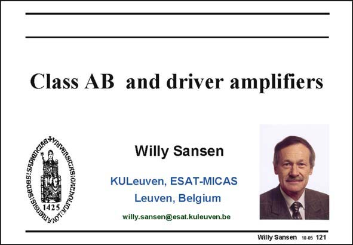

# SANSEN-121 · Slide 121

章节：12 AB 类放大器与驱动放大器  
PDF 页：330；书本页：337；幻灯片编号：121  
状态：unreviewed



## 对应教材讲解

### PDF 330 · 书本 337

To deliver power to small resistors or large capacitors cannot be achieved with conventional output stages. The output currents are too large. For this purpose we need to bias the output stages in class AB. They have small quiescent currents but can deliver very large currents to the load. Examples are obviously audio amplifiers for loudspeakers and headphones, but also communications applications such as ADSL and XDSL. All of them require large output currents but very low distortion at the same time. Audio amplifiers are limited to little over 20 kHz but XDSL amplifiers extend now to 1–3 MHz and even higher in the future. The distortion must be less than −80 dB so as not to mix up channels. This is a very severe specification indeed.

## 公式／性能结论候选摘录

以下为规则截取的原文，尚未逐项判读。

- PDF 330: Audio amplifiers are limited to little over 20 kHz but XDSL amplifiers extend now to 1–3 MHz and even higher in the future.

## 曲线结论候选摘录

以下为规则截取的原文，尚未逐项判读。

（未由规则找到；不代表原页没有此类内容。）

## 原文条件与近似候选摘录

以下为规则截取的原文，尚未逐项判读。

（未由规则找到；不代表原页没有此类内容。）

## 幻灯片 OCR（未校正）

```text
Class AB and driver amplifiers
GIG: SEDESI SRDIanG
Willy Sansen
KULeuven, ESAT-MICAS
Leuven, Belgium
willy.sansen@esat.kuleuven.be
Willy Sansen 10-05 121
```

数学上下标、分数及正负号以原图为准。电路图已保留；未核对的连接不输出成可仿真 netlist。
