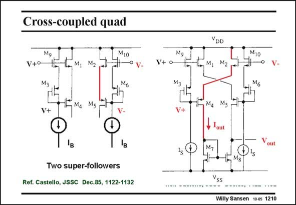

# SANSEN-1210 · Cross-coupled quad

章节：12 AB 类放大器与驱动放大器  
PDF 页：334；书本页：341；幻灯片编号：1210  
状态：unreviewed



## 对应教材讲解

### PDF 334 · 书本 341

This circuit is shown twice, once without cross-coupling to figure out the biasing, and once with the crosscoupling. The circuit on the left contains two source followers. Actually they are source followers combined with current mirrors. This is why they are called super source followers. The nMOSTs are the same and so are the pMOSTs. The current through M1 and M4 will also be I . This also applies to the current through M2/M5. B All nodes follow the input voltage. For the positive input voltage V+, the Sources of M1 and M9, but also the Drain of M3 all have obviously the same voltage swing V+. This also applies to the voltages V− of the other super source follower. Cross-coupling now the two inner lines, generates a nMOST/pMOST differential pair, with V− and V+ at their Gates, and which exhibit an expanding output current. This stage has actually four output currents, i.e. the Drain currents of M1 and M5 which increase, and also the Drain currents of M2 and M4 which decrease. They can be combined with current mirrors towards the output. In this example only two output currents are used.

## 公式／性能结论候选摘录

以下为规则截取的原文，尚未逐项判读。

- PDF 334: This stage has actually four output currents, i.e. the Drain currents of M1 and M5 which increase, and also the Drain currents of M2 and M4 which decrease.

## 曲线结论候选摘录

以下为规则截取的原文，尚未逐项判读。

（未由规则找到；不代表原页没有此类内容。）

## 原文条件与近似候选摘录

以下为规则截取的原文，尚未逐项判读。

（未由规则找到；不代表原页没有此类内容。）

## 幻灯片 OCR（未校正）

```text
Cross-coupled quad
MIo
V+o
Ms
V+
'в
Two super-followers
Ref. Castello, JSSC Dec.85, 1122-1132
V+ o
YDD
M10
M6
Willy Sansen 10.05 1210
```

数学上下标、分数及正负号以原图为准。电路图已保留；未核对的连接不输出成可仿真 netlist。
