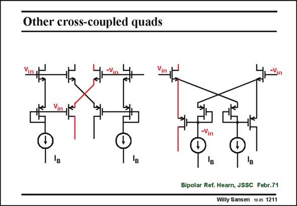

# SANSEN-1211 · Other cross-coupled quads

章节：12 AB 类放大器与驱动放大器  
PDF 页：335；书本页：342；幻灯片编号：1211  
状态：unreviewed



## 对应教材讲解

### PDF 335 · 书本 342

There are many circuit variations on these cross-coupled quadruples. In the circuit on the right, which was originally made in bipolar technologies, one transistor is left out on either side. Again all DC currents are set by the current sources I . The comple- B mentary differential pair is formed again with a nMOST, with v at its Gate, and a in pMOST, which receives a −v from the source folin lower on the right side. An expanding output current is obtained again. Again, four output currents can be distinguished. It is less symmetrical than the first cross-coupled quad, which is therefore preferred.

## 公式／性能结论候选摘录

以下为规则截取的原文，尚未逐项判读。

- PDF 335: It is less symmetrical than the first cross-coupled quad, which is therefore preferred.

## 曲线结论候选摘录

以下为规则截取的原文，尚未逐项判读。

（未由规则找到；不代表原页没有此类内容。）

## 原文条件与近似候选摘录

以下为规则截取的原文，尚未逐项判读。

（未由规则找到；不代表原页没有此类内容。）

## 幻灯片 OCR（未校正）

```text
Other cross-coupled quads
Bipolar Ref. Hearn, JSSC Febr.71
Willy Sansen 10.0s 1211
```

数学上下标、分数及正负号以原图为准。电路图已保留；未核对的连接不输出成可仿真 netlist。
