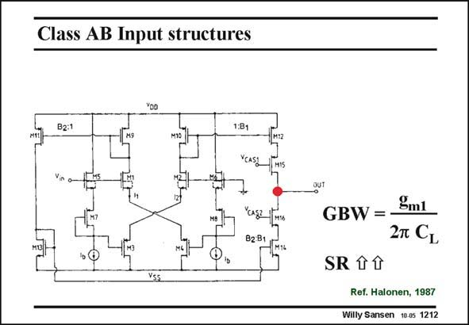

# SANSEN-1212 · Class AB Input structures

章节：12 AB 类放大器与驱动放大器  
PDF 页：335；书本页：342；幻灯片编号：1212  
状态：unreviewed



## 对应教材讲解

### PDF 335 · 书本 342

An example of such a crosscoupled quad as an input stage is shown in this slide. After all, this is a symmetrical opamp, with cascodes M15 and M16 for more gain. Normally its maximum output current is limited to B I . The Slew Rate 1 b is quite limited. However, substitution of the input differential pair by a cross-coupled quad gives an expanding current. The GBW, which is a smallsignal specification is the same, but the Slew Rate increases drastically. Only two output currents are used of the input cross-couple quad.

## 公式／性能结论候选摘录

以下为规则截取的原文，尚未逐项判读。

- PDF 335: After all, this is a symmetrical opamp, with cascodes M15 and M16 for more gain.
- PDF 335: Normally its maximum output current is limited to B I .
- PDF 335: The Slew Rate 1 b is quite limited.
- PDF 335: The GBW, which is a smallsignal specification is the same, but the Slew Rate increases drastically.

## 曲线结论候选摘录

以下为规则截取的原文，尚未逐项判读。

（未由规则找到；不代表原页没有此类内容。）

## 原文条件与近似候选摘录

以下为规则截取的原文，尚未逐项判读。

（未由规则找到；不代表原页没有此类内容。）

## 幻灯片 OCR（未校正）

```text
Class AB Input structures
B2:1
1:81
YCAST
CASZ 11
M16
82.B1
GBW = -
8ml
27 CL
SR TT
Ref. Halonen, 1987
Willy Sansen 10.0s 1212
```

数学上下标、分数及正负号以原图为准。电路图已保留；未核对的连接不输出成可仿真 netlist。
