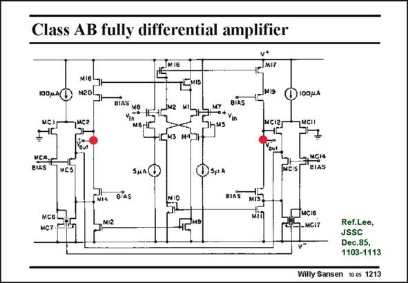

# SANSEN-1213 · Class AB fully differential amplifier

章节：12 AB 类放大器与驱动放大器  
PDF 页：336；书本页：343；幻灯片编号：1213  
状态：unreviewed



## 对应教材讲解

### PDF 336 · 书本 343

A realization of all four output currents are used of the input cross-couple quad. It is biased at low currents of 5 mA. The output currents can be much larger however, because of the expanding characteristic. All four output currents are now used towards the differential outputs. This is also a symmetrical opamp with cross-coupled quads at the inputs rather than conventional differential pairs. Common-mode feedback is required because the outputs are differential.

## 公式／性能结论候选摘录

以下为规则截取的原文，尚未逐项判读。

（未由规则找到；不代表原页没有此类内容。）

## 曲线结论候选摘录

以下为规则截取的原文，尚未逐项判读。

- PDF 336: The output currents can be much larger however, because of the expanding characteristic.

## 原文条件与近似候选摘录

以下为规则截取的原文，尚未逐项判读。

- PDF 336: The output currents can be much larger however, because of the expanding characteristic.

## 幻灯片 OCR（未校正）

```text
Class AB fully differential amplifier
MI6
LMIS
100 uA(
MIS
1100jA
BIAS
MCIZ
MCII
ИСА,г
BIAS
MCI®
BIAS
MCS
Зjа 4
BIAS
МС6.
MC7
MCI6
.MCI7
Ref.Lee,
JSSC
Dec.85,
1103-1113
Willy Sansen 10.0s 1213
```

数学上下标、分数及正负号以原图为准。电路图已保留；未核对的连接不输出成可仿真 netlist。
