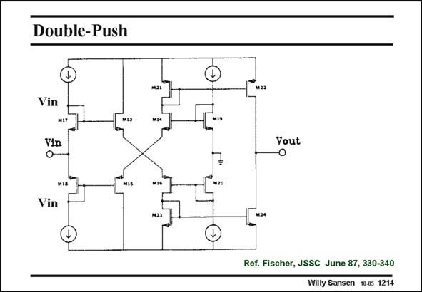

# SANSEN-1214 · Double-Push

章节：12 AB 类放大器与驱动放大器  
PDF 页：336；书本页：343；幻灯片编号：1214  
状态：unreviewed



## 对应教材讲解

### PDF 336 · 书本 343

The same cross-coupling is now used here in the output stage. The eight transistors are M13–20. The input is taken from the previous stage. It can be either one of the three points indicated. The other input is connected to ground. Only two of the four output currents are used. They are current-mirrored to the output. Transistors M22 and M24 are quite large, to be able to source and sink large currents. The quiescent current is well defined as it is directly relayed to the biasing current sources. The total schematic is shown next.

## 公式／性能结论候选摘录

以下为规则截取的原文，尚未逐项判读。

（未由规则找到；不代表原页没有此类内容。）

## 曲线结论候选摘录

以下为规则截取的原文，尚未逐项判读。

（未由规则找到；不代表原页没有此类内容。）

## 原文条件与近似候选摘录

以下为规则截取的原文，尚未逐项判读。

（未由规则找到；不代表原页没有此类内容。）

## 幻灯片 OCR（未校正）

```text
Double-Push
Vin
M1
MaL
MIA
Vin
Vin
Yout
Ref. Fischer, JSSC June 87, 330-340
Willy Sansen 10.05 1214
```

数学上下标、分数及正负号以原图为准。电路图已保留；未核对的连接不输出成可仿真 netlist。
