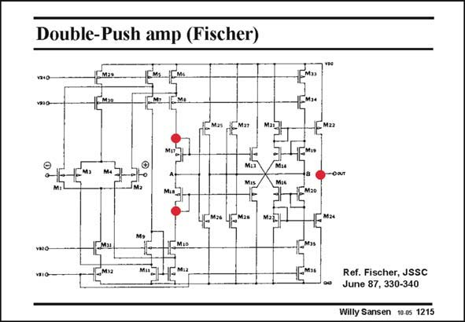

# SANSEN-1215 · Double-Push amp (Fischer)

章节：12 AB 类放大器与驱动放大器  
PDF 页：337；书本页：344；幻灯片编号：1215  
状态：unreviewed



## 对应教材讲解

### PDF 337 · 书本 344

The output stage is easily recognized because of the cross-coupled quad. It is preceded by a double folded cascode. No g equalization m is used. The points of high impedance are labeled by big (red) dots. This is clearly a two-stage amplifier. Point A is one input of the output stage. Point B is now the other one; it is no longer connected to ground. It is derived from point A by an inverter (with transistors M25-M26) which is loaded by the 1/g ’s of the two transistors M27 and M28. Its gain is thus about minus unity. m The output stage now has a differential drive. The output stage presents a load to the input stage of about 15 pF (at point A). This capacitor determines the GBW.

## 公式／性能结论候选摘录

以下为规则截取的原文，尚未逐项判读。

- PDF 337: No g equalization m is used.
- PDF 337: Its gain is thus about minus unity. m The output stage now has a differential drive.

## 曲线结论候选摘录

以下为规则截取的原文，尚未逐项判读。

（未由规则找到；不代表原页没有此类内容。）

## 原文条件与近似候选摘录

以下为规则截取的原文，尚未逐项判读。

（未由规则找到；不代表原页没有此类内容。）

## 幻灯片 OCR（未校正）

```text
Double-Push amp (Fischer)
Ma»
-Мaz
Mira
Mu
4См» Lрма*
M27
TMio
Mis
Ref. Fischer, JSSC
June 87, 330-340
Willy Sansen 10.0s 1215
```

数学上下标、分数及正负号以原图为准。电路图已保留；未核对的连接不输出成可仿真 netlist。
