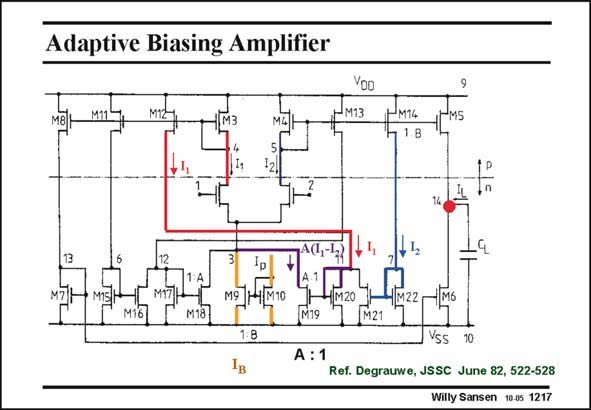

# SANSEN-1217 · Adaptive Biasing Amplifier

章节：12 AB 类放大器与驱动放大器  
PDF 页：338；书本页：345；幻灯片编号：1217  
状态：unreviewed



## 对应教材讲解

### PDF 338 · 书本 345

An adaptive biasing amplifier adapts its biasing to be able to provide larger output currents. The amplifier in this slide is a symmetrical amplifier, which is single ended. Nowadays it would be differential. Two times two current mirrors are added, i.e. with transistors M11/M12 and M13/M14. Without these transistors the maximum output current would be limited to BI . P In order to increase this maximum current, biasing current I must be made larger for larger p input voltages. This biasing current is adapted to the input signal level. This is why it is in parallel with two more current mirrors through transistors M18 and M19. Let us follow the path to transistor M19. Transistors M19 forms a current mirror (with current factor A) with M20. This latter transistor take the difference in current I –I , which are proportional to the currents in the input stage. 1 2 The larger of these two currents wins. If I is larger than I then AI current is added to I , 1 2 1 p increasing the total biasing current of the first stage, and also increasing the maximum output current. If, however, I is larger than I , then it is mirrored by M17/M18, also multiplied by A and 2 1 also added to I . p The adaptive current feedback is a kind of rectifier, as shown next.

## 公式／性能结论候选摘录

以下为规则截取的原文，尚未逐项判读。

- PDF 338: Without these transistors the maximum output current would be limited to BI .
- PDF 338: P In order to increase this maximum current, biasing current I must be made larger for larger p input voltages.
- PDF 338: This latter transistor take the difference in current I –I , which are proportional to the currents in the input stage. 1 2 The larger of these two currents wins.

## 曲线结论候选摘录

以下为规则截取的原文，尚未逐项判读。

（未由规则找到；不代表原页没有此类内容。）

## 原文条件与近似候选摘录

以下为规则截取的原文，尚未逐项判读。

（未由规则找到；不代表原页没有此类内容。）

## 幻灯片 OCR（未校正）

```text
Adaptive Biasing Amplifier
M13
M14
1.8
M17,
M9
M18
1:8
A : 1
Vss
10
Ref. Degrauwe, JSSC June 82, 522-528
Willy Sansen 10.0s 1217
```

数学上下标、分数及正负号以原图为准。电路图已保留；未核对的连接不输出成可仿真 netlist。
