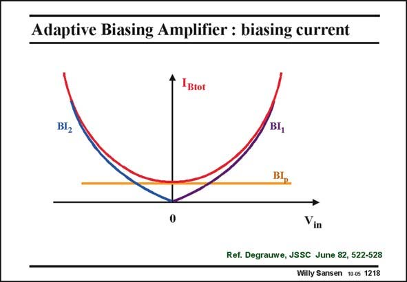

# SANSEN-1218 · Adaptive Biasing Amplifier : biasing current

章节：12 AB 类放大器与驱动放大器  
PDF 页：338；书本页：345；幻灯片编号：1218  
状态：unreviewed



## 对应教材讲解

### PDF 338 · 书本 345

For small input voltages, the biasing current of the first stage I is only I . The maxi- B p mum output current is Bi . p For larger input voltages, for terminal 1 being more positive than terminal 2, current I increases drasti- 1 cally and is fed back to the input biasing current. With terminal 2 being more positive than terminal 1 however, current I 2 increases by a similar amount and is also fed back to the input biasing current.

### PDF 339 · 书本 346

This total biasing current increases in either direction. The amount of increase depends on current factor A.

## 公式／性能结论候选摘录

以下为规则截取的原文，尚未逐项判读。

- PDF 338: The maxi- B p mum output current is Bi . p For larger input voltages, for terminal 1 being more positive than terminal 2, current I increases drasti- 1 cally and is fed back to the input biasing current.
- PDF 338: With terminal 2 being more positive than terminal 1 however, current I 2 increases by a similar amount and is also fed back to the input biasing current.
- PDF 339: This total biasing current increases in either direction.
- PDF 339: The amount of increase depends on current factor A.

## 曲线结论候选摘录

以下为规则截取的原文，尚未逐项判读。

（未由规则找到；不代表原页没有此类内容。）

## 原文条件与近似候选摘录

以下为规则截取的原文，尚未逐项判读。

（未由规则找到；不代表原页没有此类内容。）

## 幻灯片 OCR（未校正）

```text
Adaptive Biasing Amplifier : biasing current
•Btot
BI2
BI,
Vin
Ref. Degrauwe, JSSC June 82, 522-528
Willy Sansen 10.0s 1218
```

数学上下标、分数及正负号以原图为准。电路图已保留；未核对的连接不输出成可仿真 netlist。
