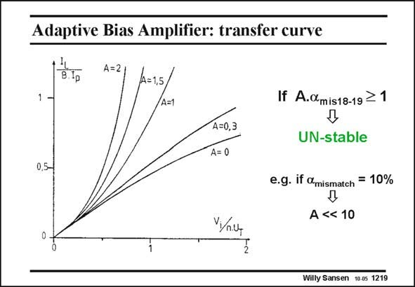

# SANSEN-1219 · Adaptive Bias Amplifier: transfer curve

章节：12 AB 类放大器与驱动放大器  
PDF 页：339；书本页：346；幻灯片编号：1219  
状态：unreviewed



## 对应教材讲解

### PDF 339 · 书本 346

For a current factor A equal to zero, no adaptive biasing takes place. The output current (normalized to Bi ) is p limited for larger input voltages (normalized to nU or T nkT/q.). For an increasing factor A however, the expansion of the output current with the input voltage is more and more pronounced. A class-AB behavior is now obtained. Factor A cannot be increased to very large values, depending on matching. A practical limit is about 10. If cascodes are used however, the matching between all the current sources improves remarkably. Higher factors of A can then be tried. A disadvantage of this amplifier is that transistors M11–14 are added on the node where the non-dominant pole is formed. They will therefore slow down the amplifier.

## 公式／性能结论候选摘录

以下为规则截取的原文，尚未逐项判读。

- PDF 339: For a current factor A equal to zero, no adaptive biasing takes place.
- PDF 339: The output current (normalized to Bi ) is p limited for larger input voltages (normalized to nU or T nkT/q.).
- PDF 339: Factor A cannot be increased to very large values, depending on matching.
- PDF 339: A practical limit is about 10.
- PDF 339: They will therefore slow down the amplifier.

## 曲线结论候选摘录

以下为规则截取的原文，尚未逐项判读。

（未由规则找到；不代表原页没有此类内容。）

## 原文条件与近似候选摘录

以下为规则截取的原文，尚未逐项判读。

（未由规则找到；不代表原页没有此类内容。）

## 幻灯片 OCR（未校正）

```text
Adaptive Bias Amplifier: transfer curve
1-
A=2
A=1,5,
A=1
0,5-
A=0,3
A= 0
If A.@mis18-19 ≥ 1
Д
UN-stable
e.g. if Omismatch = 10%
A << 10
V/ц
Willy Sansen 10-.05 1219
```

数学上下标、分数及正负号以原图为准。电路图已保留；未核对的连接不输出成可仿真 netlist。
