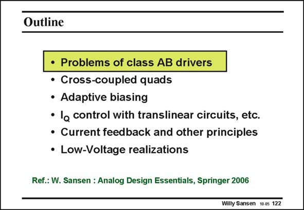

# SANSEN-122 · Slide 122

章节：12 AB 类放大器与驱动放大器  
PDF 页：330；书本页：337；幻灯片编号：122  
状态：unreviewed



## 对应教材讲解

### PDF 330 · 书本 337

Let us first look at the specifications of a class-AB opamp. What are the problems? A large number of possible solutions are introduced and discussed. A few circuits are added with supply voltages of 1 V or less.

## 公式／性能结论候选摘录

以下为规则截取的原文，尚未逐项判读。

（未由规则找到；不代表原页没有此类内容。）

## 曲线结论候选摘录

以下为规则截取的原文，尚未逐项判读。

（未由规则找到；不代表原页没有此类内容。）

## 原文条件与近似候选摘录

以下为规则截取的原文，尚未逐项判读。

（未由规则找到；不代表原页没有此类内容。）

## 幻灯片 OCR（未校正）

```text
Outline
• Problems of class AB drivers
• Cross-coupled quads
• Adaptive biasing
• la control with translinear circuits, etc.
• Current feedback and other principles
• Low-Voltage realizations
Ref.: W. Sansen : Analog Design Essentials, Springer 2006
Willy Sansen 10.05 122
```

数学上下标、分数及正负号以原图为准。电路图已保留；未核对的连接不输出成可仿真 netlist。
