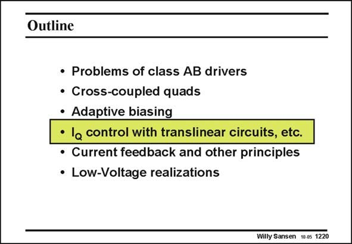

# SANSEN-1220 · Slide 1220

章节：12 AB 类放大器与驱动放大器  
PDF 页：339；书本页：346；幻灯片编号：1220  
状态：unreviewed



## 对应教材讲解

### PDF 339 · 书本 346

A class-AB output stage can also be biased by translinear circuits, as explained previously. A translinear loop is a circuit which provides a linear relationship by use of nonlinear circuits. The simplest example is a current mirror. Both transistors have a nonlinear current-voltage relationship and yet the current gain is perfectly linear. The voltage between the two transistors is heavily distorted though.

## 公式／性能结论候选摘录

以下为规则截取的原文，尚未逐项判读。

- PDF 339: Both transistors have a nonlinear current-voltage relationship and yet the current gain is perfectly linear.

## 曲线结论候选摘录

以下为规则截取的原文，尚未逐项判读。

（未由规则找到；不代表原页没有此类内容。）

## 原文条件与近似候选摘录

以下为规则截取的原文，尚未逐项判读。

（未由规则找到；不代表原页没有此类内容。）

## 幻灯片 OCR（未校正）

```text
Outline
• Problems of class AB drivers
• Cross-coupled quads
• Adaptive biasing
• la control with translinear circuits, etc.
• Current feedback and other principles
• Low-Voltage realizations
Willy Sansen 10.05 1220
```

数学上下标、分数及正负号以原图为准。电路图已保留；未核对的连接不输出成可仿真 netlist。
