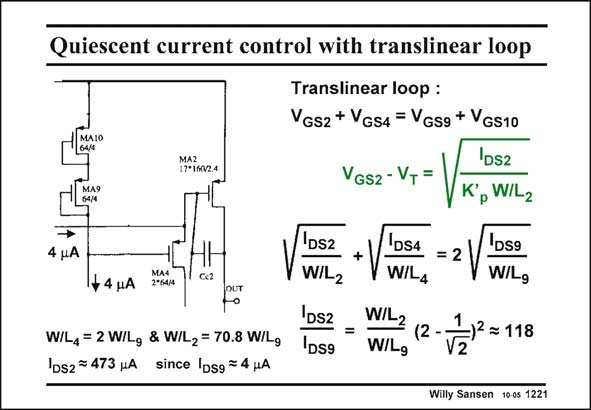

# SANSEN-1221 · Quiescent current control with translinear loop

章节：12 AB 类放大器与驱动放大器  
PDF 页：340；书本页：347；幻灯片编号：1221  
状态：unreviewed



## 对应教材讲解

### PDF 340 · 书本 347

A translinear loop is formed by transistors MA2/MA4 and MA9/MA10. Their sum of V ’s is equal. GS The currents through MA9–MA10 are set by a DC current source (which is about 4 mA in this example). The current through MA4 is also set by the DC current of the preceding stage (which is also about 4 mA in this example). Only the current through the large output transistor MA2 is not known. Its current is then defined by the expression in this slide. All transistor sizes W/L’s are known. All parameters V and K∞ cancel out. T p As a result, we obtain an expression linking the currents to the transistor sizes. The current I through transistor MA2 is about 120 times larger than the current through transistor MA9. DS2 It is now well defined. It is independent of the supply voltage. A disadvantage of this loop however, is that I only becomes large when I becomes zero, DS2 DS4 since I is constant. Transistor MA4 shuts off for large drives and limits the output current. DS9

## 公式／性能结论候选摘录

以下为规则截取的原文，尚未逐项判读。

- PDF 340: Their sum of V ’s is equal.
- PDF 340: T p As a result, we obtain an expression linking the currents to the transistor sizes.
- PDF 340: It is independent of the supply voltage.
- PDF 340: Transistor MA4 shuts off for large drives and limits the output current.

## 曲线结论候选摘录

以下为规则截取的原文，尚未逐项判读。

（未由规则找到；不代表原页没有此类内容。）

## 原文条件与近似候选摘录

以下为规则截取的原文，尚未逐项判读。

（未由规则找到；不代表原页没有此类内容。）

## 幻灯片 OCR（未校正）

```text
Quiescent current control with translinear loop
MAZ
12*16024
4 pA
+ 4 HA
MA4
2°6414
Ce2
OUT
Translinear loop :
VGs2 + VGs4 = VGsg + VGs10
VGS2 - VT
DS2
Kp W/L2
W/L4 = 2 W/Lg & W/L2 = 70.8 W/Lg
IDs2 = 473 uA since IDsg = 4 HA
Ds2
W/L2
'DS2
DS9
DS4
WIL4
W/L2
(2 -
W/Lg
= 2 /
DS9
W/Lg
≥ 118
Willy Sansen 100s 1221
```

数学上下标、分数及正负号以原图为准。电路图已保留；未核对的连接不输出成可仿真 netlist。
