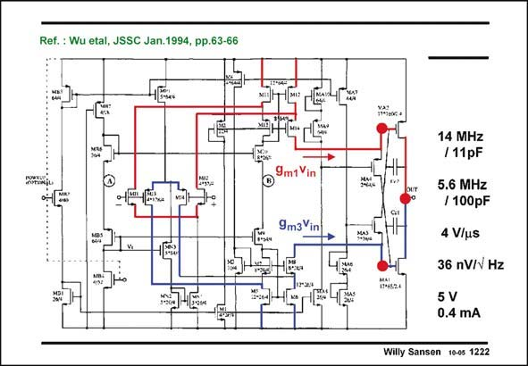

# SANSEN-1222 · Ref.: Wu etal, JSSC Jan.1994, pp.63-66

章节：12 AB 类放大器与驱动放大器  
PDF 页：340；书本页：347；幻灯片编号：1222  
状态：unreviewed



## 对应教材讲解

### PDF 340 · 书本 347

A practical example of such a translinear loop is shown in this slide. The transistors MA2/ MA4 and MA9/MA10 have actually been copied on the previous slide. They form a translinear loop indeed. The same applies to the transistors MA1/MA3 which form a translinear loop with MA5/MA6. The quiescent current in the output transistors is thus given by the expression on the previous slide. It is now easy to see where the DC currents are coming from. The current through MA9/MA10 comes form a DC biasing current mirror. The DC current through MA4 comes from the pMOST differential current amplifier M11–14 at the end of the nMOST first stage. This current flows through the nMOST differential current amplifier M5–8 at the end of the pMOST first stage.

### PDF 341 · 书本 348

Transistors MA3 and MA4 carry this DC current as well but no AC current. They are bootstrapped out for AC behavior. They present an infinite AC impedance to the currents coming from the first stage. This is shown next.

## 公式／性能结论候选摘录

以下为规则截取的原文，尚未逐项判读。

- PDF 340: The quiescent current in the output transistors is thus given by the expression on the previous slide.

## 曲线结论候选摘录

以下为规则截取的原文，尚未逐项判读。

（未由规则找到；不代表原页没有此类内容。）

## 原文条件与近似候选摘录

以下为规则截取的原文，尚未逐项判读。

（未由规则找到；不代表原页没有此类内容。）

## 幻灯片 OCR（未校正）

```text
Ref.: Wu etal, JSSC Jan.1994, pp.63-66
9m1 Vin
9m3Vin
14 MHz
/11pF
5.6 MHz
/ 100pF
4 V/us
36 nV/v Hz
5 V
0.4 mA
Willy Sansen 10-0s 1222
```

数学上下标、分数及正负号以原图为准。电路图已保留；未核对的连接不输出成可仿真 netlist。
