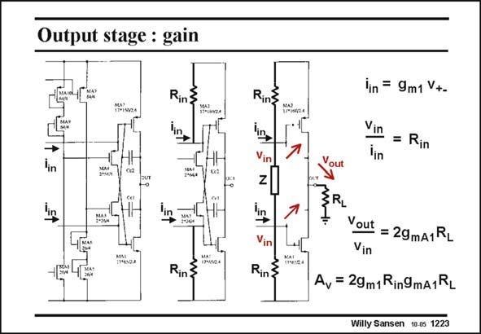

# SANSEN-1223 · Output stage : gain

章节：12 AB 类放大器与驱动放大器  
PDF 页：341；书本页：348；幻灯片编号：1223  
状态：unreviewed



## 对应教材讲解

### PDF 341 · 书本 348

The output stage is shown three times, but more and more simplified. First, note that the current provided by the current differential amplifiers of the first stage are in phase. The output impedances of the first stage are shown explicitly in the second figure. The transistors MA3 and MA4 are substituted by some impedance Z in the third one. Since both input currents have the same phase, they both increase the gates of the output transistors by about the same voltage. There is nearly no AC voltage drop across the impedance Z. It is bootstrapped out. It does not appear in the expression of the gain A . v Transistors MA3 and MA4 only play a role in the translinear loop to set the quiescent current trough the output devices. They do not play a role in the gain of GBW. Transistors MA3 and MA4 carry this DC current as well but no AC current. They are bootstrapped out for AC behavior. They present an infinite AC impedance to the currents coming from the first stage.

## 公式／性能结论候选摘录

以下为规则截取的原文，尚未逐项判读。

- PDF 341: Since both input currents have the same phase, they both increase the gates of the output transistors by about the same voltage.
- PDF 341: It does not appear in the expression of the gain A . v Transistors MA3 and MA4 only play a role in the translinear loop to set the quiescent current trough the output devices.
- PDF 341: They do not play a role in the gain of GBW.

## 曲线结论候选摘录

以下为规则截取的原文，尚未逐项判读。

- PDF 341: First, note that the current provided by the current differential amplifiers of the first stage are in phase.
- PDF 341: Since both input currents have the same phase, they both increase the gates of the output transistors by about the same voltage.

## 原文条件与近似候选摘录

以下为规则截取的原文，尚未逐项判读。

- PDF 341: First, note that the current provided by the current differential amplifiers of the first stage are in phase.

## 幻灯片 OCR（未校正）

```text
Output stage : gain
Rin}
lin
lin
Rin
Rins
'in
Vin
Rin&
out
lin = 9m1 V+-
Vin
lin
Rin
Vout
= 29mA1RL
Vin
Av = 29m1Rin9mA1RL
Willy Sansen 10.05 1223
```

数学上下标、分数及正负号以原图为准。电路图已保留；未核对的连接不输出成可仿真 netlist。
