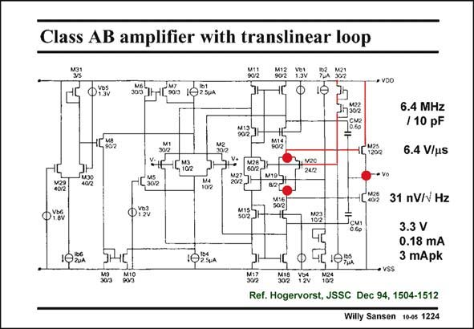

# SANSEN-1224 · Class AB amplifier with translinear loop

章节：12 AB 类放大器与驱动放大器  
PDF 页：341；书本页：348；幻灯片编号：1224  
状态：unreviewed



## 对应教材讲解

### PDF 341 · 书本 348

A similar translinear loop to set the quiescent current through the output devices is found in this amplifier. It is a two-stage amplifier. The compensation capacitances are connected to the outputs of the first stage through the cascodes M14 and M16. The translinear loop with output transistor M25 is highlighted. A similar one is present for output transistor M26.

### PDF 342 · 书本 349

Again transistors M19/ M20 are bootstrapped out for AC performance. The first stage is a rail-to-rail input stage, which has been discussed in the previous Chapter.

## 公式／性能结论候选摘录

以下为规则截取的原文，尚未逐项判读。

（未由规则找到；不代表原页没有此类内容。）

## 曲线结论候选摘录

以下为规则截取的原文，尚未逐项判读。

（未由规则找到；不代表原页没有此类内容。）

## 原文条件与近似候选摘录

以下为规则截取的原文，尚未逐项判读。

（未由规则找到；不代表原页没有此类内容。）

## 幻灯片 OCR（未校正）

```text
Class AB amplifier with translinear loop
802
902
• VDO
6.4 MHz
/ 10 pF
6.4 V/us
g, v20
242
L 4072
M23
10/2
Jcui
0.60
31 nV/V Hz
3.3 V
0.18 mA
3 mApk
•vSS
Ref. Hogervorst, JSSC Dec 94, 1504-1512
Willy Sansen 10-0s 1224
```

数学上下标、分数及正负号以原图为准。电路图已保留；未核对的连接不输出成可仿真 netlist。
