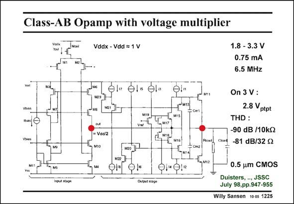

# SANSEN-1225 · Class-AB Opamp with voltage multiplier

章节：12 AB 类放大器与驱动放大器  
PDF 页：342；书本页：349；幻灯片编号：1225  
状态：unreviewed



## 对应教材讲解

### PDF 342 · 书本 349

This is again a two-stage amplifier. A single-ended folded cascode is the first stage. The second stage consists of the two output transistors. Transistors M13/M15 and M16/ M18 form wideband level shifters between the output of the first stage and the Gates of the output transistors. They are bootstrapped out for AC signals. The quiescent current in the output transistors is set by two translinear loops. Output transistor M11 with M13 forms a translinear loop with transistors M23 and M21. Transistors M13 and M21 are equal and carry equal currents. The quiescent current in M11 is set by transistor M23. The same applies to the translinear loop of M12/M14 with M22/M20.

## 公式／性能结论候选摘录

以下为规则截取的原文，尚未逐项判读。

- PDF 342: Transistors M13 and M21 are equal and carry equal currents.

## 曲线结论候选摘录

以下为规则截取的原文，尚未逐项判读。

（未由规则找到；不代表原页没有此类内容。）

## 原文条件与近似候选摘录

以下为规则截取的原文，尚未逐项判读。

（未由规则找到；不代表原页没有此类内容。）

## 幻灯片 OCR（未校正）

```text
Class-AB Opamp with voltage multiplier
Vddx - Vdd = 1 V
1.8 - 3.3 V
0.75 mA
6.5 MHz
els el-
Vbias
= Vdd/2
Cioad
On 3 V:
2.8 Vptpt
THD :
-90 dB /10kS2
-81 dB/32 S2
О"O.
112
Input stox
0.5 um CMOS
Duisters, , JSSC
July 98,pp.947-955
Willy Sansen 10 0s 1225
```

数学上下标、分数及正负号以原图为准。电路图已保留；未核对的连接不输出成可仿真 netlist。
