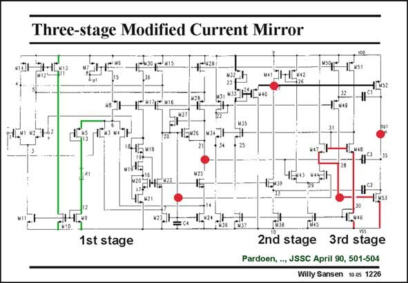

# SANSEN-1226 · Three-stage Modified Current Mirror

章节：12 AB 类放大器与驱动放大器  
PDF 页：342；书本页：349；幻灯片编号：1226  
状态：unreviewed



## 对应教材讲解

### PDF 342 · 书本 349

This is a three-stage amplifier with nested Miller compensation. The high impedance nodes are labeled with big (red) dots. The input stage consists of two folded cascodes. The g −equalization is carried m out by transistor M5, resistor R1 and the following current mirrors. When the average input voltage increases, the pMOSTs are slowly turned off, but the current through resistor R1 increases, increasing the currents in the input nMOSTs. It is a simple solution. However, the use of a resistor makes this solution depending on the supply voltage. The second stage is a differential pair, one output of which is directly connected to the gate of the output nMOST M53. The other output has to be inverted first before it can be applied to the output pMOST M52. The output devices of a class-AB stage always have to be driven in phase.

### PDF 343 · 书本 350

The translinear loops which set the quiescent current are highlighted. They are easily recognized. This amplifier can drive 4000 pF. It can sink and source about 100 mA. On 2.5 V it takes about 0.6 mA. Its GBW is 1 MHz. Its main disadvantage is that its Slew Rate is not sufficiently high, causing some cross-over distortion.

## 公式／性能结论候选摘录

以下为规则截取的原文，尚未逐项判读。

- PDF 342: The g −equalization is carried m out by transistor M5, resistor R1 and the following current mirrors.
- PDF 342: When the average input voltage increases, the pMOSTs are slowly turned off, but the current through resistor R1 increases, increasing the currents in the input nMOSTs.
- PDF 342: However, the use of a resistor makes this solution depending on the supply voltage.

## 曲线结论候选摘录

以下为规则截取的原文，尚未逐项判读。

- PDF 342: The output devices of a class-AB stage always have to be driven in phase.

## 原文条件与近似候选摘录

以下为规则截取的原文，尚未逐项判读。

（未由规则找到；不代表原页没有此类内容。）

## 幻灯片 OCR（未校正）

```text
Three-stage Modified Current Mirror
TENS1
м ]1-1[к2
32
N49
11u52
E wh
NS3
1st stage
Toks
2n'd stage 3rd stage
Pardoen, --, JSSC April 90, 501-504
Willy Sansen 10.05 1226
```

数学上下标、分数及正负号以原图为准。电路图已保留；未核对的连接不输出成可仿真 netlist。
