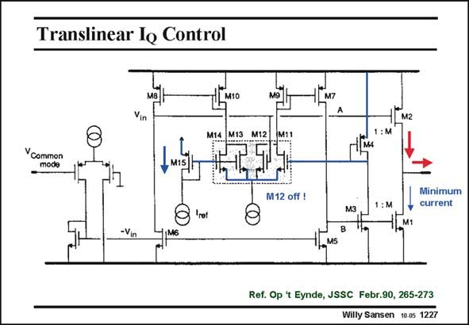

# SANSEN-1227 · Translinear lo Control

章节：12 AB 类放大器与驱动放大器  
PDF 页：343；书本页：350；幻灯片编号：1227  
状态：unreviewed



## 对应教材讲解

### PDF 343 · 书本 350

This is the third stage of a three-stage amplifier. The complementary input voltages v are shown, as in generated by the second stage. The top one is applied directly to the pMOST output transistor M2. The complementary input −v is in inverted and applied to the nMOST output transistor M1. This transistor is copied to M3 but M times smaller. The current through M3 and M4 is therefore a measure of the current through M1. A three-fold translinear loop is now formed. Two of them include the output transistors. They are M2/M12 and M4/M11. They are added towards current mirror M9/M7. The third one is M15/M13+14. They are added towards current mirror M10/M8. The purpose of these loops is to prevent one output transistor to go off, when the other one is carrying a large current. Indeed when transistor M2 provides a large output current, M1 may shut off. Even for large output currents, a minimum current through M1 must be guaranteed. This decreases the cross-over distortion and increases the speed. If the current through M1 is very small, the currents through M3 and M4 are also small. As a result, V becomes larger. For a large current in M2, V becomes smaller. The product GS11 GS12 of the two currents through M11 and M12 is set by the reference current through M15. They cannot go below a certain value.

## 公式／性能结论候选摘录

以下为规则截取的原文，尚未逐项判读。

- PDF 343: The current through M3 and M4 is therefore a measure of the current through M1.
- PDF 343: This decreases the cross-over distortion and increases the speed.
- PDF 343: As a result, V becomes larger.

## 曲线结论候选摘录

以下为规则截取的原文，尚未逐项判读。

（未由规则找到；不代表原页没有此类内容。）

## 原文条件与近似候选摘录

以下为规则截取的原文，尚未逐项判读。

（未由规则找到；不代表原页没有此类内容。）

## 幻灯片 OCR（未校正）

```text
Translinear lo Control
Vin
M2
Y Common
mode
M15
M12 off !
Iret
:M
Minimum
current
M1
-Vin
M6
MS
Ref. Op 't Eynde, JSSC Febr.90, 265-273
Willy Sansen 10.0s 1227
```

数学上下标、分数及正负号以原图为准。电路图已保留；未核对的连接不输出成可仿真 netlist。
