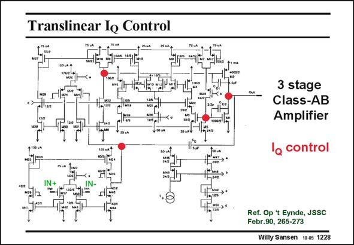

# SANSEN-1228 · Translinear le Control

章节：12 AB 类放大器与驱动放大器  
PDF 页：344；书本页：351；幻灯片编号：1228  
状态：unreviewed



## 对应教材讲解

### PDF 344 · 书本 351

The full amplifier is shown in this slide. The three stages are used to increase the gain, yielding very low distortion. The first and second stages are symmetrical amplifiers. The third stage consists of two output devices with the quiescentcurrent control described in the previous slide. Nested Miller compensation is used. Its GBW is 5 MHz. It gives only −80 dB THD at 10 kHz in 81 V in parallel with 15 pF. The quiescent current is 1.4 mA.

## 公式／性能结论候选摘录

以下为规则截取的原文，尚未逐项判读。

- PDF 344: The three stages are used to increase the gain, yielding very low distortion.

## 曲线结论候选摘录

以下为规则截取的原文，尚未逐项判读。

（未由规则找到；不代表原页没有此类内容。）

## 原文条件与近似候选摘录

以下为规则截取的原文，尚未逐项判读。

（未由规则找到；不代表原页没有此类内容。）

## 幻灯片 OCR（未校正）

```text
Translinear le Control
3 stage
Class-AB
Amplifier
o control
Ref. Op 't Eynde, JSSC
Febr.90, 265-273
Willy Sansen 10.0s 1228
```

数学上下标、分数及正负号以原图为准。电路图已保留；未核对的连接不输出成可仿真 netlist。
