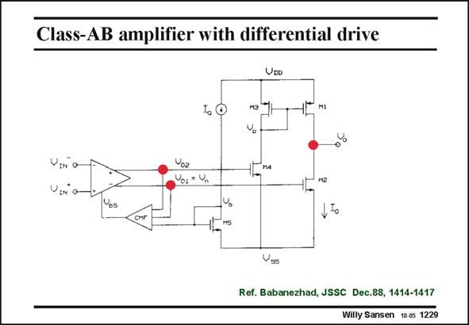

# SANSEN-1229 · Class-AB amplifier with differential drive

章节：12 AB 类放大器与驱动放大器  
PDF 页：344；书本页：351；幻灯片编号：1229  
状态：unreviewed



## 对应教材讲解

### PDF 344 · 书本 351

In this two stage amplifier, a translinear loop is used to control the quiescent current. However, it is used to provide common-feedback at the same time. The principle is fairly straightforward. A fully differential amplifier is used at the input. One output drives output transistor M2 directly. The other one has to be inverted first. Since the output has a differential output, CMFB is required. This circuit sets the average output voltages, which are used at the same time to control the V values of the GS output devices, thus also controlling the quiescent current in the output transistors. The full circuit is given next.

## 公式／性能结论候选摘录

以下为规则截取的原文，尚未逐项判读。

- PDF 344: This circuit sets the average output voltages, which are used at the same time to control the V values of the GS output devices, thus also controlling the quiescent current in the output transistors.

## 曲线结论候选摘录

以下为规则截取的原文，尚未逐项判读。

（未由规则找到；不代表原页没有此类内容。）

## 原文条件与近似候选摘录

以下为规则截取的原文，尚未逐项判读。

（未由规则找到；不代表原页没有此类内容。）

## 幻灯片 OCR（未校正）

```text
Class-AB amplifier with differential drive
VED
VIN
VIN
Ref. Babanezhad, JSSC Dec.88, 1414-1417
Willy Sansen 10.0s 1229
```

数学上下标、分数及正负号以原图为准。电路图已保留；未核对的连接不输出成可仿真 netlist。
