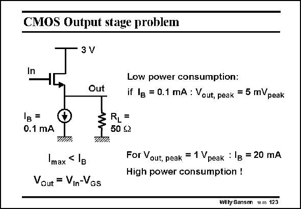

# SANSEN-123 · CMOS Output stage problem

章节：12 AB 类放大器与驱动放大器  
PDF 页：331；书本页：338；幻灯片编号：123  
状态：unreviewed



## 对应教材讲解

### PDF 331 · 书本 338

For a low-resistor load, a low output impedance is required. The source follower is the only simple transistor stage which provides this output resistance. However, its DC current handling is not sufficient. A source follower is shown, biased at 0.1 mA. A low resistor of 50 V is connected to it. It is clear that the maximum output voltage swing can only be 5 mV. For higher output voltages, we would need higher biasing currents as well. This would lead to an excessive power consumption. We now need a transistor circuit which can deliver large currents only when needed, but with a low quiescent biasing current to lower the power consumption as much as possible. Note that this transistor stage can deliver (source) a large current but it can only sink the DC biasing current. The positive output swing can therefore be large, but not the negative swing.

## 公式／性能结论候选摘录

以下为规则截取的原文，尚未逐项判读。

- PDF 331: The positive output swing can therefore be large, but not the negative swing.

## 曲线结论候选摘录

以下为规则截取的原文，尚未逐项判读。

（未由规则找到；不代表原页没有此类内容。）

## 原文条件与近似候选摘录

以下为规则截取的原文，尚未逐项判读。

（未由规则找到；不代表原页没有此类内容。）

## 幻灯片 OCR（未校正）

```text
CMOS Output stage problem
3 V
In
Out
Low power consumption:
if IB = 0.1 mA : Vout, peak = 5 mVpeak
IB =
0.1 mA
TIRH.
max
,< IB
Vout = Vin-Vgs
RLF
50 ≤2
For Vout, peak = 1 Vpeak : 1B = 20 mA
High power consumption !
Wilty Sansen m.ns 123
```

数学上下标、分数及正负号以原图为准。电路图已保留；未核对的连接不输出成可仿真 netlist。
