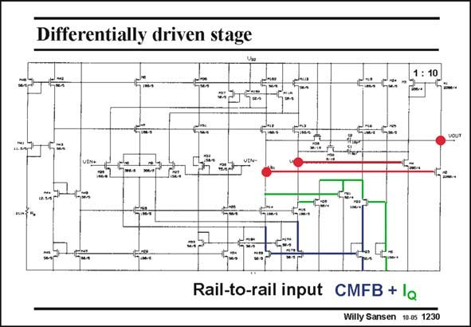

# SANSEN-1230 · Differentially driven stage

章节：12 AB 类放大器与驱动放大器  
PDF 页：345；书本页：352；幻灯片编号：1230  
状态：unreviewed



## 对应教材讲解

### PDF 345 · 书本 352

The input stage is a fullydifferential rail-to-rail amplifier. Its outputs are labeled with big (red) dots. One of them goes directly to the nMOST output transistor. The other one is inverted first. A differential output needs common-mode feedback. This is accomplished by measurement of the two outputs with transistors M20/M21. Their Sources are joined together to cancel the differential signal. This common-mode signal is then fed through a cascode (M22), to a current mirror with transistors M23, M16B and M17B. The same transistors are part of the translinear loops to set the quiescent current in the output stage. For the nMOST output transistor, the loop consists of transistors M2/M21 with M22/M5. For the pMOST output transistor, M4 is taken instead. The loop then consists of transistors M4/M20, again with M22/M5. The setting for the average output voltage of the first stage is also used to set the V ’s of the GS output devices, and hence the quiescent current.

## 公式／性能结论候选摘录

以下为规则截取的原文，尚未逐项判读。

（未由规则找到；不代表原页没有此类内容。）

## 曲线结论候选摘录

以下为规则截取的原文，尚未逐项判读。

（未由规则找到；不代表原页没有此类内容。）

## 原文条件与近似候选摘录

以下为规则截取的原文，尚未逐项判读。

（未由规则找到；不代表原页没有此类内容。）

## 幻灯片 OCR（未校正）

```text
Differentially driven stage
1 :10
Rail-to-rail input CMFB + la
Willy Sansen 10.0s 1230
```

数学上下标、分数及正负号以原图为准。电路图已保留；未核对的连接不输出成可仿真 netlist。
