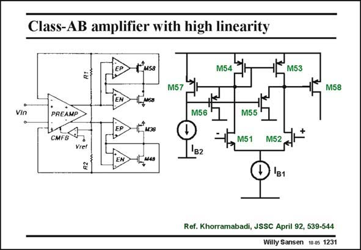

# SANSEN-1231 · Class-AB amplifier with high linearity

章节：12 AB 类放大器与驱动放大器  
PDF 页：345；书本页：352；幻灯片编号：1231  
状态：unreviewed



## 对应教材讲解

### PDF 345 · 书本 352

This class-AB amplifier uses a separate opamp to drive the Gates of all four output devices. The load is connected between the two output voltages. It is therefore floating. These opamps are required to provide sufficient gain, even when the output devices enter the linear region. As a result, the distortion is always small. The amplifier EP which drives output transistor M58 is sketched as well. The feedback loop is not closed. It is a conventional voltage amplifier with input devices M51/M52. The load current mirror is shunted by two cascodes however M55/M56 to limit the gain (to about 7), again to reduce the distortion.

### PDF 346 · 书本 353

The quiescent current is set by the translinear loop M58/M55 and M57/M56 such that the current through the output transistor is about I times the ratio of M58 to M57. B2

## 公式／性能结论候选摘录

以下为规则截取的原文，尚未逐项判读。

- PDF 345: It is therefore floating.
- PDF 345: These opamps are required to provide sufficient gain, even when the output devices enter the linear region.
- PDF 345: As a result, the distortion is always small.
- PDF 345: The load current mirror is shunted by two cascodes however M55/M56 to limit the gain (to about 7), again to reduce the distortion.

## 曲线结论候选摘录

以下为规则截取的原文，尚未逐项判读。

（未由规则找到；不代表原页没有此类内容。）

## 原文条件与近似候选摘录

以下为规则截取的原文，尚未逐项判读。

（未由规则找到；不代表原页没有此类内容。）

## 幻灯片 OCR（未校正）

```text
Class-AB amplifier with high linearity
[M5S
M54
M53
M57
M58
Vin
PREAMP
CMFS 1
Yret
Eмos
M56'
M55
M51
M52
'в2
B1
Ref. Khorramabadi, JSSC April 92, 539-544
Willy Sansen 10.05 1231
```

数学上下标、分数及正负号以原图为准。电路图已保留；未核对的连接不输出成可仿真 netlist。
