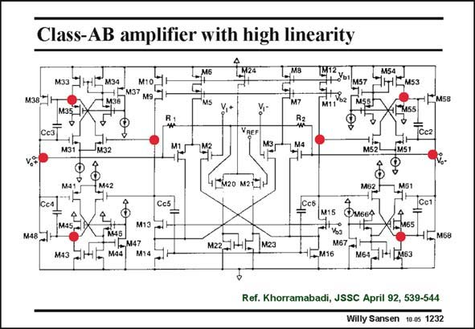

# SANSEN-1232 · Class-AB amplifier with high linearity

章节：12 AB 类放大器与驱动放大器  
PDF 页：346；书本页：353；幻灯片编号：1232  
状态：unreviewed



## 对应教材讲解

### PDF 346 · 书本 353

On the total schematic, the four output transistors with their amplifier, are easily recognized. The amplifier is shown with unity-gain feedback. Actually, this is a threestage amplifier. The input stage is a folded cascode. Distributed Miller compensation is applied however, not nested Miller. This method of compensation is much less transparent. The CMFB amplifier is in the middle, with M20/M21 and R2/R3.

## 公式／性能结论候选摘录

以下为规则截取的原文，尚未逐项判读。

- PDF 346: The amplifier is shown with unity-gain feedback.

## 曲线结论候选摘录

以下为规则截取的原文，尚未逐项判读。

（未由规则找到；不代表原页没有此类内容。）

## 原文条件与近似候选摘录

以下为规则截取的原文，尚未逐项判读。

（未由规则找到；不代表原页没有此类内容。）

## 幻灯片 OCR（未校正）

```text
Class-AB amplifier with high linearity
мзз Чні мза
M10
+[м37 м9
M36
M6
MS
V,+
LMa
M7
M38 H
Cc3
M31
м32
VREr
4[мг0 м21
Cc4
Cc5
M13
-M47
M4з JHt- Mis
M14
м22, I141 м2a
M5gh
M5B
4 7M55
M52-
Tocz
MMST
MOZM5I
MIS OMGGA
Cc1
4 -
XTM65
4Т мБ8
M67-
HMS6
N6+ 1-(2163
Ref. Khorramabadi, JSSC April 92, 539-544
Willy Sansen 10.05 1232
```

数学上下标、分数及正负号以原图为准。电路图已保留；未核对的连接不输出成可仿真 netlist。
